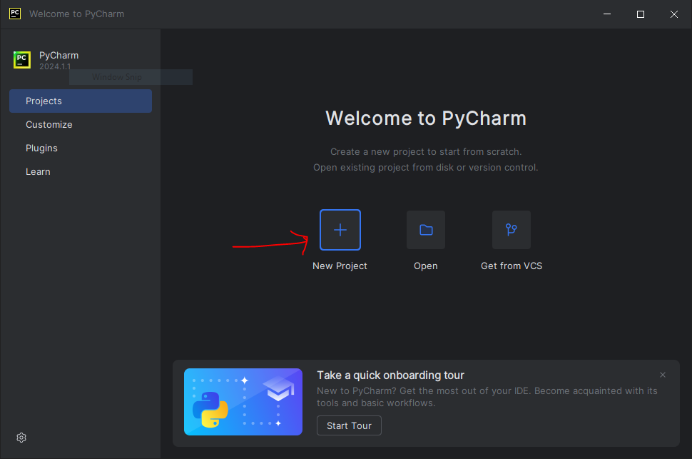
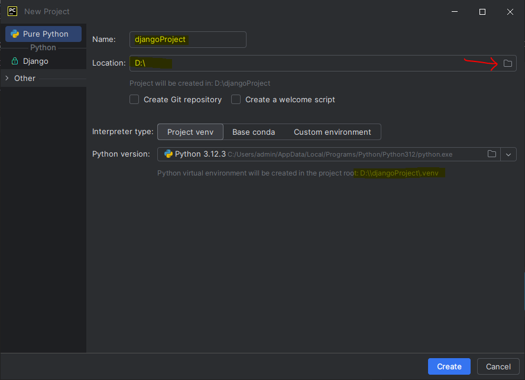
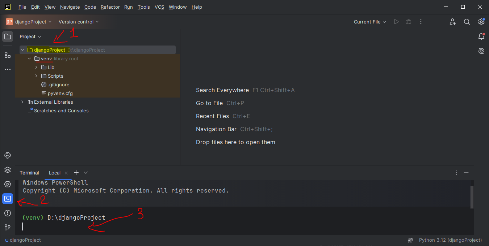
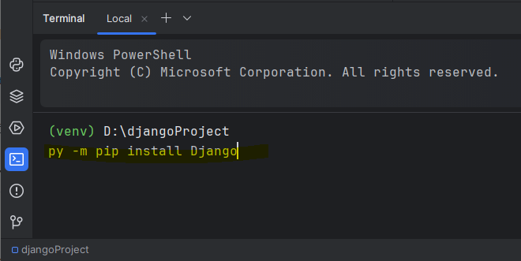
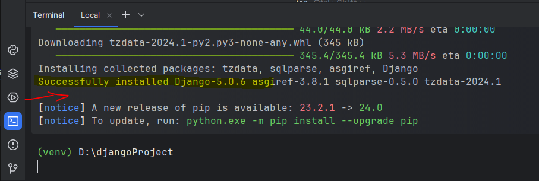
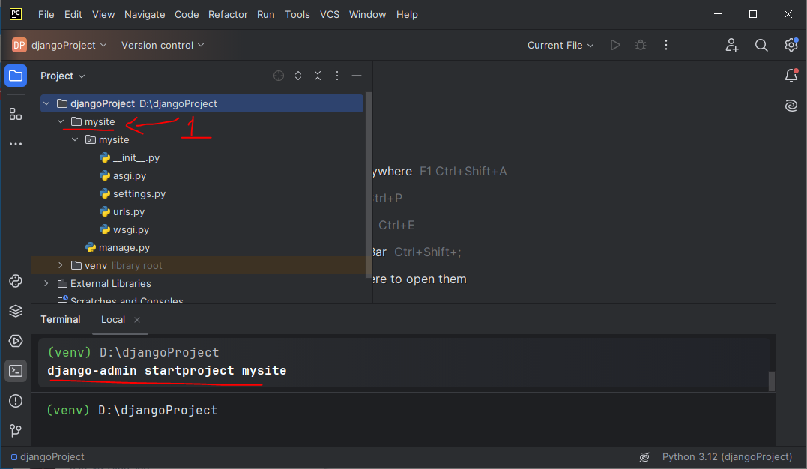
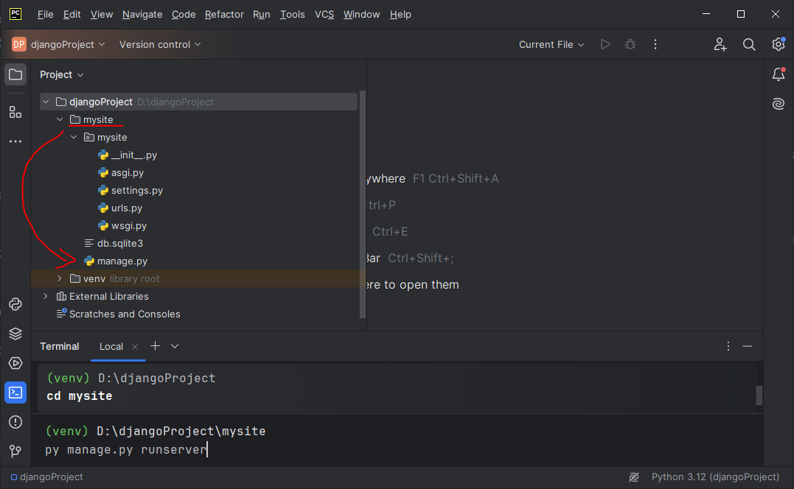
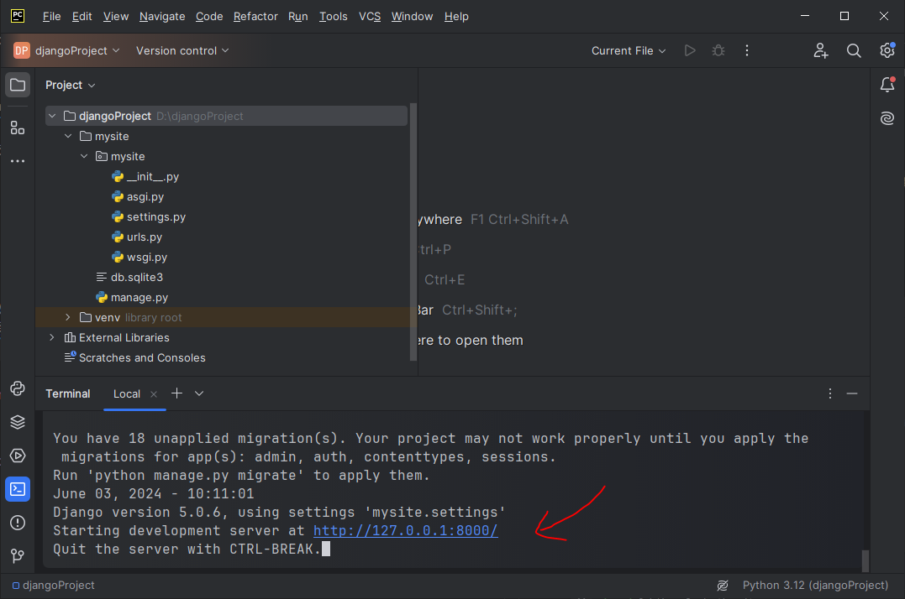

# Tạo dự án Python Django với PyCharm

## 💛 Tạo Project mới

Mở phần mềm Pycharm lên, ngay màn hình khởi động, chọn `New Project`.

Hoặc nếu bạn đang ở trong một dự án đang mở, chọn `File` -> `New Project`



Sau đó, thiết lập nhưng thông tin như hình sau:



Trong đó:

- `Name`: tên dự án
- `Location`: Vị trí nơi lưu dự án trong ổ đĩa máy tính, bạn có thể thay đổi vị trí ở hình mũi tên đỏ.
- Mặc định PyCharm sẽ tự động tạo một thư mục `venv`, nơi lưu các cấu hình riêng cho dự án, bạn có thể thay đổi đường dẫn ở hình mũi tên đỏ. Bạn có thể custom lại ở tab `Custom environment` tại dòng `Interpreter type`


Và cuối cùng click `Create` để tạo dự án mới. Kết quả được như hình dưới đây.




- Mục số 1: là cấu trúc dự án
- Mục số 2: Xem cửa sổ Terminal dự án
- Mục số 3: cửa số lệnh Terminal của dự án hiện tại


Và bạn thấy rằng, môi trường ảo đã dược `PyCharm` tự động kích hoạt, bạn không cần làm thủ công như cách đã biết.

## 💛 Cài đặt Django framework

Tại cửa sổ `Terminal`, trong môi trường ảo như trên, nhập lệnh sau:

```bash
pip install django
```



Sau đó nhấn `Enter` để cài đặt.

Nếu thành công sẽ có thông báo như hình sau




## 💛 Khởi tạo một project Django

Tại cửa sổ `Terminal`, trong môi trường ảo như trên, nhập lệnh sau:

```bash
django-admin startproject mysite
```

Sau đó Enter




Khi đó `projectDjango` của bạn sẽ có cấu trúc thư mục như sau:

```html
├── projectDjango
    ├── mysite
    │   ├── manage.py
    │   └── mysite
    │       ├── __init__.py
    │       ├── asgi.py
    │       ├── settings.py
    │       ├── urls.py
    │       └── wsgi.py
    ├── venv
```

Bao gồm folder cấu hình môi trường ảo và folder chứa code dự án.


## 💛 Chạy project Django

Tại cửa sổ `Terminal`, trong môi trường ảo như trên, nhập lệnh sau:

```bash
cd mysite
```

Để di chuyển vào thư mục gốc django chứa file `manage.py`, sau đó nhập lệnh sau để chạy project:

```bash
python manage.py runserver
```



Kết quả được như hình sau



Django sẽ khởi tạo một server local ở port `8000`, bạn có thể giữ phím Ctrl + Click vào link `http://127.0.0.1:8000/` để xem kết quả.

