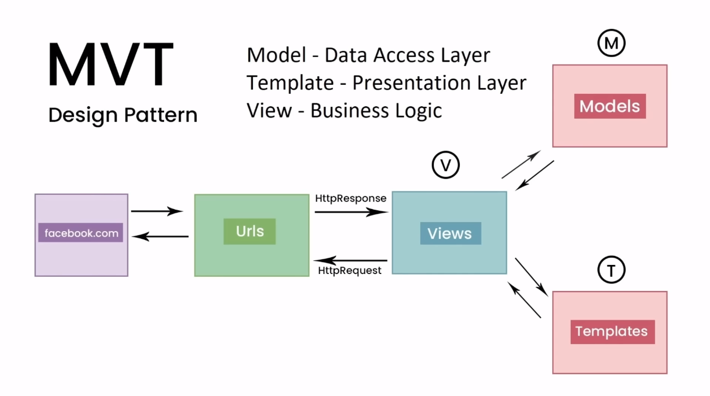
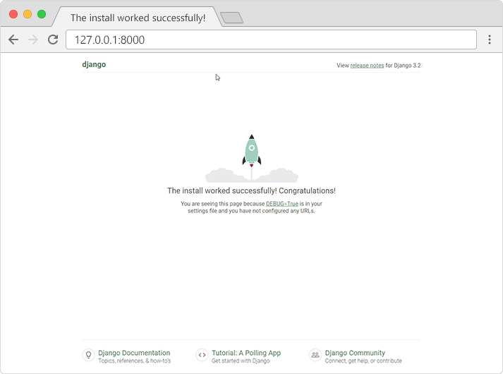
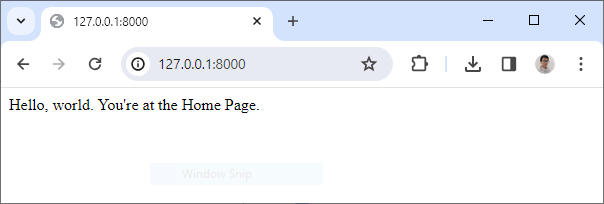

# Session 01 - Getting Started

## 💛 Giới thiệu về Django framework

Django là một framework web mã nguồn mở được viết bằng Python. Django được phát triển bởi Django Software Foundation (DSF), một tổ chức phi lợi nhuận độc lập. Ra mắt phiên bản đầu tiên vào `7-2005` bởi `Lawrence Journal-World`


Django được thiết kế để giúp các nhà phát triển tập trung vào viết các ứng dụng mà không cần phải xây dựng lại từ đầu


Django được thiết kế theo mô hình MTV (Model-Template-Views). Mục tiêu chính của Django là dễ dàng tạo ra các trang web phức tạp, dựa trên cơ sở dữ liệu.


Django có hệ thống đặt tên riêng cho tất cả các chức năng và thành phần. Django cũng có một bảng quản trị, được cho là dễ hơn so với Laravel hoặc Yii.

Django có một trong những hệ thống bảo mật tiện lợi và tốt nhất hiện nay, nó giúp các lập trình viên tránh các vấn đề bảo mật phổ biến như: Clickjacking, Script chéo trang, Chèn SQL.

Django có thể được dùng để xây dựng hầu hết các loại website, từ hệ thống quản lý nội dung, cho đến các trang mạng xã hội hay web tin tức.

## 💛 MVT Patten trong Django



Django dựa trên kiến trúc MVT (Model-View-Template). MVT là một mô hình thiết kế phần mềm để phát triển một ứng dụng web. Cấu trúc MVT bao gồm ba phần sau:

1. **Model**: Model sẽ hoạt động như giao diện của dữ liệu của bạn. Nó chịu trách nhiệm duy trì dữ liệu. Đây là cấu trúc dữ liệu logic đằng sau toàn bộ ứng dụng và được biểu diễn bởi một cơ sở dữ liệu (thông thường là cơ sở dữ liệu quan hệ như MySql, Postgres).
2. **View**: View là giao diện người dùng - những gì bạn thấy trong trình duyệt của mình khi bạn render một trang web. Nó được biểu diễn bởi các tệp HTML/CSS/Javascript và Jinja.
3. **Template**: Một template bao gồm các phần tĩnh của đầu ra HTML mong muốn cũng như một số cú pháp đặc biệt mô tả cách nội dung động sẽ được chèn.

Mặc dù Django tuân theo mô hình MVC nhưng lại duy trì các quy ước riêng của mình. Vì vậy, việc kiểm soát được xử lý bởi chính framework. Không có bộ điều khiển riêng biệt và toàn bộ ứng dụng dựa trên Model, View và Template. Đó là lý do tại sao nó được gọi là ứng dụng MVT.


## 💛Yêu cầu cài đặt Django framework

- Cài đặt Python phiên bản mới nhất
- Cài đặt pip (Python Package Index - một hệ thống quản lý gói cho Python)

Bạn có thể sử dụng câu lệnh sau để kiểm tra xem đã cài đặt chưa

```bash
python --version
# Output Example: Python 3.9.2
pip --version
# Output Example: pip 20.2.3 from c:\python39\lib\site-packages\pip (python 3.9)
```

Nếu chưa cài bạn có thể tải bản cài đặt Python tại link sau: https://www.python.org/downloads/

Ngoài ra bạn cần cài một kiểu Database như MySQL, PostgreSQL

## 💛Cấu hình môi trường ảo cho dự án (Virtual Environment)


Virtual Environment (môi trường ảo) trong Python, thường được gọi là "virtualenv", là một công cụ quan trọng khi phát triển với Django. Nó tạo ra một môi trường Python độc lập, cho phép bạn quản lý các phụ thuộc cụ thể của dự án mà không ảnh hưởng đến cài đặt Python trên toàn hệ thống.

Virtual Environment giống như máy ảo (Virtual Machine), nó thiết lập một môi trường ảo, cho phép bạn tự do thử nghiệm với các packages của Python mà không làm ảnh hưởng đến những packages đã được cài đặt sẵn trên Python. Ví dụ, bạn muốn thử nghiệm với Django 1.8 trong khi trên hệ thống đang cài đặt Django 1.4 LTS.

Các bước để tạo ra môi trường cho một dự án:

Ví dụ bạn cần tạo một dự án (project) quản lý bán xe đạp trực tuyến với **Django framework** đặt tên folder dự án là `projectBikeStore`


**Bước 1** Mở cửa sổ lệnh `Command Prompt` hoặc `Terminal`

Ví dụ bạn đang đứng ở vị trí `D:\Test-Django\projectBikeStore\`

Command Prompt của Windows

```bash
D:\Test-Django\projectBikeStore>py -m venv venvBikeStore
```

Terminal của Mac/Ubuntu

```bash
python -m venv venvBikeStore
```

Trong đó `venvBikeStore` là tên của folder chứa cấu hình môi trường ảo cho dự án với cấu trúc file/ thư mục như sau:


```html
├── venvBikeStore
│   ├── Include
│   ├── Lib
│   ├── Scripts
│   └── pyvenv.cfg
```

Cấu trúc thư mục của môi trường ảo Python (venv) gồm các thành phần sau:

- Include: Thư mục này chứa các tệp tiêu đề `C`.
- Lib: Thư mục này chứa các thư viện Python. Khi bạn cài đặt một package Python bằng pip trong môi trường ảo, nó sẽ được cài đặt vào thư mục này.
- Scripts: Thư mục này chứa các script cần thiết để kích hoạt môi trường ảo. Trên hệ điều hành Linux, thư mục này thường được gọi là `bin`.
- pyvenv.cfg: Đây là tệp cấu hình cho môi trường ảo. Nó chứa thông tin về phiên bản Python được sử dụng và liệu có sử dụng các package hệ thống hay không.

**Bước 2** Kích hoạt môi trường

Command Prompt của Windows

```bash
D:\Test-Django\projectBikeStore>venvBikeStore\Scripts\activate.bat
```

Terminal của Mac/Ubuntu

```bash
source  venvBikeStore/bin/activate
```

Sau đó bạn sẽ thấy được kết quả

Command Prompt của Windows

```bash
(venvBikeStore) D:\Test-Django\projectBikeStore>
```

Terminal của Mac/Ubuntu

```bash
(venvBikeStore) ...$
```

## 💛 Cài đặt Django framework

Sau khi bạn activated môi trường ảo xong. Để cài đặt `Django framework` cho dự án, bạn thực hiện lệnh:

Command Prompt của Windows

```bash
(venvBikeStore) D:\Test-Django\projectBikeStore>py -m pip install Django
```

Terminal của Mac/Ubuntu

```bash
(venvBikeStore) ...$ python -m pip install Django
```

Sau đó hệ thống sẽ tải và cài đặt Django trong môi trường ảo.


## 💛 Tạo một Project với Django framework

Để tạo một project có tên `bikestore` bạn sử dụng câu lệnh sau

```bash
django-admin startproject bikestore
```

Khi đó `projectBikeStore` của bạn sẽ có cấu trúc thư mục như sau:

```html
├── projectBikeStore
    ├── bikestore
    │   ├── manage.py
    │   └── bikestore
    │       ├── __init__.py
    │       ├── asgi.py
    │       ├── settings.py
    │       ├── urls.py
    │       └── wsgi.py
    ├── venvBikeStore
```

Bao gồm folder cấu hình môi trường ảo và folder chứa code dự án.

## 💛Giới thiệu cấu trúc của Django framework

Trong cấu trúc thư mục trên

- **bikestore**: ở thư mục gốc là tên của dự án (Project name). Bên trong chứa soucre của dự án
- **manage.py**: Đây là một công cụ dòng lệnh giúp quản lý dự án Django. Nó giúp bạn tạo ra các ứng dụng, chạy server, chạy các lệnh liên quan đến database và nhiều hơn thế.
- **bikestore**: Đây là thư mục gốc (root) của dự án Django. Nó chứa các file cấu hình và là nơi chứa các ứng dụng của dự án.
- **asgi.py**:  File này cho phép các máy chủ web tương thích ASGI phục vụ dự án của bạn
- **settings.py**: Đây là file cấu hình của dự án Django3. Nó chứa tất cả các cài đặt của dự án, bao gồm cấu hình database, các ứng dụng được cài đặt, các thiết lập middleware, v.v
- **urls.py**: File này chứa tất cả các khai báo URL đến các `views` để xử lý `http request`
- **wsgi.py**: File này cho phép bạn triển khai dự án Django của mình qua WSGI


## 💛 Khởi chạy dự án

Để chạy dự án bạn nhập lệnh


Command Prompt của Windows

```bash
(venvBikeStore) D:\Test-Django\projectBikeStore>py manage.py runserver
```

Terminal của Mac/Ubuntu

```bash
(venvBikeStore) ...$ python manage.py runserver
```

Bạn sẽ thấy được kết quả ở cửa số lệnh

```bash
Performing system checks...

System check identified no issues (0 silenced).

You have unapplied migrations; your app may not work properly until they are applied.
Run 'python manage.py migrate' to apply them.

January 31, 2024 - 15:50:53
Django version 5.0, using settings 'bikstore.settings'
Starting development server at http://127.0.0.1:8000/
Quit the server with CONTROL-C.
```

Mặc định hệ thống sẽ chạy trên cổng mặc định `8000`

Bạn có thể chạy trên local với port khác với câu lệnh

```bash
# Windows
py manage.py runserver 8080
# MacOS, Ubuntu
python manage.py runserver 8080
```

Kết quả: http://127.0.0.1:8000/



Như vậy là bạn đã tạo thành công dự án website với Django Framework

## 💛Tạo một App mới trong Django framework


Trong Django, một ứng dụng (app) thường được sử dụng để đóng gói một chức năng hoặc một tập hợp các chức năng liên quan. Mỗi ứng dụng có thể chứa nhiều model, và mỗi model tương ứng với một bảng trong cơ sở dữ liệu.

Một trang web sẽ có nhiều trang, theo concept của Django thì môi trang như vậy là một `app` (ứng dụng)

Dự kiên các trang trong một trang web bán hàng xe đạp

```html
├── / - Trang chủ
├── /categories/:id - Hiển thị danh sách sản phẩm của 1 danh mục
├── /products/:id - Hiển thị Chi tiết 1 sản phẩm
├── /cart - Hiển thị danh sách sản phẩm trong giỏ hàng
├── /checkout - Đặt hàng
├── /contact - Hiển thị thông tin liên hệ
├── /about - Giới thiệu về cửa hàng
├── /login - Trang khách hàng đăng nhập
├── /register - Trang khách hàng đăng ký tài khoản
├── /customers - Trang Dashboard của khách hàng
├── /customers/profile - Thông tin khách hàng
├── /customers/orders - Danh sách các đơn hàng đã đặt của khách hàng
├── /posts - Hiển thị danh sách các bài viết
├── /posts/:id/details - Hiển thị chi tiết một bài viết
├── /stores - Danh sách các cửa hàng

```

Ví dụ bạn tạo trang chủ với tên là app `home`

Nếu bạn đang chạy server rồi thì bạn cần mở một cửa sổ lệnh mới. Và đang đứng trong môi trường ảo của dự án.


```bash
# Windows
py manage.py startapp home
# MacOS, Ubuntu
python manage.py startapp home
```

Kết quả cử mỗi app bạn tạo ra hệ thống sẽ sinh ra một folder mới trong project


```html
├── projectBikeStore
    ├── bikestore
    │   ├── manage.py
    │   └── bikestore
    │   └── home
    │       ├── __init__.py
    │       ├── admin.py
    │       ├── apps.py
    │       ├── migrations
    |       |   ├── __init__.py
    │       ├── tests.py
    │       ├── views.py
    │       └── url.py (Không có khi tạo)
    ├── venvBikeStore
```

Trong đó, các file có chức năng như sau:

- `__init__.py`: File này chỉ ra rằng thư mục `my_app` nên được coi là một Python package. Tập tin này chủ yếu là trống.

- `admin.py`: Chứa các thông tin liên quan đến việc triển khai module admin cho website.

- `apps.py`: Nơi chứa các config của app.

- `migrations/`: Thư mục này chứa các file migration, được Django sử dụng để theo dõi các thay đổi bạn thực hiện đối với model của bạn.

- `models.py`: Nơi chứa các khai báo đối tượng trong database của app. Đây là nơi bạn định nghĩa các lớp Python, mỗi lớp tương ứng với một bảng trong cơ sở dữ liệu.

- `tests.py`: Chứa các test case dùng để thực hiện unit-test.

- `views.py`: Lớp này chứa các logic để truy cập dữ liệu qua Model và truyền nó ra ngoài cho Template tương ứng. Nó như là Controller trong mô hình MVC


Sau đó bạn mở file `home/view.py` trong trình soạn thảo code và thêm vào nội dung sau


```python
from django.http import HttpResponse

# Hàm xử lý logic cho trang chủ
def index(request):
    return HttpResponse("Hello, world. You're at the Home Page.")
```

Tiếp tục tạo  file `home/url.py` mặc định khi tạo app, file này không được sinh ra.


```python
from django.urls import path
from . import views

# Định tuyến URL cho trang chủ
# Có nghĩa là khi URL là /, thì dùng view nào để hiển thị. Dùng hàm index đã khai báo trong view.py
urlpatterns = [
    path("", views.index, name="index"),
]
```

Cuối cùng bạn cấu hình URL cho project, để project nhận các URL từ app `home`

Bạn sửa file `bikestore/url.py`

```python
from django.contrib import admin
# Sửa lại dòng này thành như sau
from django.urls import include, path

urlpatterns = [
    path("", include("home.urls")), #Thêm dòng này vào để định nghĩa rẳng / sẽ show app Home lên
    path("admin/", admin.site.urls),
]
```

Cứ mỗi lần bạn thay đổi các thành phần trong project bạn phải khởi động lại server để những thay đổi có hiệu lực. CTRL + Break hoặc CTRL + C.

Sau đó khởi động lại

```bash
# Windows
py manage.py runserver
# MacOS, Ubuntu
$ python manage.py runserver
```


Kết quả



## 💛 Tìm hiểu Cấu hình  `settings.py`

Chi tiết: https://docs.djangoproject.com/en/5.0/ref/settings/