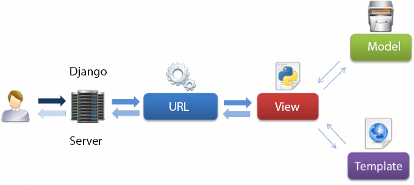
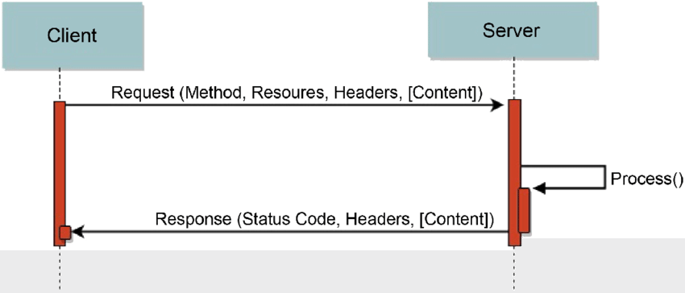
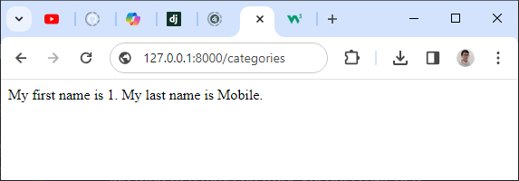

# Session 02 - URLs and views

## 💛 MVT Patten trong Django



Django dựa trên kiến trúc MVT (Model-View-Template). MVT là một mô hình thiết kế phần mềm để phát triển một ứng dụng web. Cấu trúc MVT bao gồm ba phần sau:

1. **Model**: Model sẽ hoạt động như giao diện của dữ liệu của bạn. Nó chịu trách nhiệm duy trì dữ liệu. Đây là cấu trúc dữ liệu logic đằng sau toàn bộ ứng dụng và được biểu diễn bởi một cơ sở dữ liệu (thông thường là cơ sở dữ liệu quan hệ như MySql, Postgres).
2. **View**: View là giao diện người dùng - những gì bạn thấy trong trình duyệt của mình khi bạn render một trang web. Nó được biểu diễn bởi các tệp HTML/CSS/Javascript và Jinja.
3. **Template**: Một template bao gồm các phần tĩnh của đầu ra HTML mong muốn cũng như một số cú pháp đặc biệt mô tả cách nội dung động sẽ được chèn.

Mặc dù Django tuân theo mô hình MVC nhưng lại duy trì các quy ước riêng của mình. Vì vậy, việc kiểm soát được xử lý bởi chính framework. Không có bộ điều khiển riêng biệt và toàn bộ ứng dụng dựa trên Model, View và Template. Đó là lý do tại sao nó được gọi là ứng dụng MVT.


## 💛 Tìm hiểu về View trong Django

Trong Django, **View** là một hàm Python hoặc một phương thức (trong trường hợp bạn sử dụng class-based views) nhận một web request và trả về một web response. 

Response có thể là nội dung HTML của một trang web, hoặc một redirect, hoặc một lỗi 404, hoặc một tài liệu XML, hoặc một hình ảnh... hoặc bất cứ thứ gì. View chứa bất kỳ logic tùy ý nào cần thiết để trả về response đó.

Django sử dụng mô hình MVT (Model-View-Template) thay vì mô hình MVC (Model-View-Controller) truyền thống. Trong Django, View được cọi như là controller và teamplate như là view trong mô hình MVC.

Theo cách triển khai của Django, view sẽ thể hiện dữ liệu trả về cho người dùng. Nó không chỉ là cách hiển thị dữ liệu như thế nào, mà còn là những dữ liệu nào được hiển thị.

Cùng tìm hiểu `View` qua một ví dụ

Tạo một app mới tên là `categories`

```bash
# Windows
py manage.py startapp categories
# MacOS, Ubuntu
$ python manage.py startapp categories
```

Bạn sửa lại file `categories/view.py` thành như sau

```python
from django.http import HttpResponse

#URL: localhost:8000/categories
# Hàm này hiển thị danh sách các danh mục
# Đặt tên hàm là index để hiểu là entry point như trong MVC
def index(request):
    html = '<html><body><h1>Categories List</h1></body></html>';
    # Response lại cho client chuỗi HTML
    # status=200 là trạng thái thành công mặc định
    return HttpResponse(html, status=200)
```

Bạn có thể hiểu hàm trên xử lý logic để trả về kết quả cho client.

- Đầu vào là request
- Đầu ra là HttpResponse

---

## 💛 Tìm hiểu về Request, Response



Cách hoạt động ứng dụng web:

1. **Client** gửi một **Request** đến Server. Request này bao gồm:
   - **Method**: Phương thức HTTP như GET, POST, PUT, DELETE, etc.
   - **Resources**: Đường dẫn tới tài nguyên trên Server mà Client muốn truy cập.
   - **Headers**: Thông tin bổ sung về Request.
   - **Content** (tùy chọn): Dữ liệu mà Client muốn gửi đến Server (thường có trong các Request POST hoặc PUT).

2. Khi nhận được Request, **Server** sẽ xử lý nó (như được biểu diễn bởi `Process()` trong hình).

3. Sau khi xử lý xong, Server sẽ gửi lại một **Response** cho Client. Response này bao gồm:
   - **Status Code**: Mã trạng thái HTTP như 200 (OK), 404 (Not Found), 500 (Internal Server Error), etc.
   - **Headers**: Thông tin bổ sung về Response.
   - **Content** (tùy chọn): Dữ liệu mà Server muốn gửi lại cho Client.


### 🔥 Requests

Trong ví dụ về `app categories` trên bạn thấy trong hàm `index(request)` nhận vào tham số `request`

Request mang theo một trong các methods: GET, POST, PUT, DELETE. Mặc định được hiểu là GET.

Dựa vào method này `view.py` sẽ xử lý các logic tương ứng sau đó trả lại kết quả cho client thông qua response.


### 🔥 Response

Đọc thêm về django.http:
- [django.http](django.http.md)
- https://docs.djangoproject.com/en/5.0/ref/request-response/#django.http.HttpResponse


---

## 💛 Tìm hiểu về Template trong Django

Trong Django, **Template** là một tài liệu văn bản hoặc một chuỗi Python được đánh dấu sử dụng ngôn ngữ template của Django. Một số cấu trúc được nhận biết và giải thích bởi công cụ template. Những cấu trúc chính là biến và thẻ. Một template được render với một context. Việc render thay thế các biến bằng giá trị của chúng, được tra cứu trong context, và thực thi các thẻ.

Template trong Django cung cấp một ngôn ngữ mini mạnh mẽ để xác định lớp giao diện người dùng của ứng dụng của bạn, khuyến khích sự tách biệt sạch sẽ giữa logic ứng dụng và logic trình bày. Template có thể được duy trì bởi bất kỳ ai có hiểu biết về HTML; không cần kiến thức về Python.

Vì sao cần Template trong Django? Có một số lý do chính:

1. **Tách biệt giữa logic ứng dụng và logic trình bày**: Điều này giúp mã nguồn dễ đọc hơn, dễ bảo dưỡng hơn và giúp các nhà phát triển có thể tập trung vào công việc của mình mà không phải lo lắng về các khía cạnh khác của ứng dụng.

2. **Tính tái sử dụng**: Bạn có thể tái sử dụng các template hoặc phần của chúng trong các trang web khác nhau, giúp tiết kiệm thời gian và công sức.

3. **Đơn giản hóa việc tạo giao diện người dùng**: Với templates, bạn chỉ cần tập trung vào việc thiết kế giao diện người dùng mà không cần phải viết mã để tạo ra HTML.

4. **Khả năng tùy chỉnh cao**: Django cho phép bạn tạo các template tag và filter tùy chỉnh, giúp bạn có thể tạo ra các template phức tạp và linh hoạt.


Tìm hiểu tất cả về Template: https://docs.djangoproject.com/en/5.0/ref/templates/

---

### 🔥 Cú pháp template Django

#### 🔹 Biến trong Template

Biến riêng lẻ:

```django
<p>My first name is {{ first_name }}. My last name is {{ last_name }}.</p>
```

Biến là object:

```django
{{ my_dict.key }}
{{ my_object.attribute }}
{{ my_list.0 }}
```

---

#### 🔹 Tags trong Template


Trong Django, **tags** là một phần quan trọng của ngôn ngữ template. Chúng cho phép bạn thực hiện các logic lập trình như thực thi các câu lệnh if và vòng lặp for. Để thực thi các tags, chúng ta bao quanh chúng trong dấu ``.

Có nhiều loại tags có sẵn trong Django, bao gồm:

- `autoescape`: Kiểm soát hành vi tự động thoát hiện tại.
- `block`: Định nghĩa một khối có thể được ghi đè bởi các template con.
- `comment`: Bỏ qua mọi thứ giữa `` và ``.
- `csrf_token`: Được sử dụng để bảo vệ các form khỏi Cross Site Request Forgeries.
- `cycle`: Tạo ra một trong các đối số của nó mỗi khi gặp tag này.
- `extends`: Định nghĩa một template cha.
- `for`: Định nghĩa một vòng lặp for.
- `if`: Định nghĩa một câu lệnh if.

Ví dụ, bạn có thể sử dụng tag `if` như sau:

```html

    <h1>Hello</h1>

    <h1>Bye</h1>

```

Trong ví dụ trên, nếu biến `greeting` bằng 1, thì template sẽ render "Hello". Nếu không, nó sẽ render "Bye".

=> [Xem thêm cách sử dụng tại đây](django.template.md)

Tags giúp bạn tạo ra các template phức tạp và linh hoạt, cho phép bạn thực hiện các logic lập trình trên máy chủ trước khi gửi HTML đến client.

Danh sách các Tags dựng sẵn:

- https://docs.djangoproject.com/en/5.0/ref/templates/builtins/#ref-templates-builtins-tags


Tự tạo một Tag cho mục đích của mình

- https://docs.djangoproject.com/en/5.0/howto/custom-template-tags/#how-to-create-custom-template-tags-and-filters

---

#### 🔹 Filter trong Template

Trong Django, **filters** là một phần quan trọng của ngôn ngữ template. Chúng cho phép bạn thay đổi cách hiển thị một biến trong template. Filters được định nghĩa bằng cách sử dụng một ký tự ống `|` theo sau là tên của filter. Các đối số được định nghĩa bằng cách sử dụng một dấu hai chấm `:` theo sau là giá trị đối số.

Có nhiều loại filters có sẵn trong Django, bao gồm:

- `add`: Cộng một giá trị với giá trị của biến.
- `capfirst`: Viết hoa chữ cái đầu tiên của biến.
- `cut`: Xóa tất cả các lần xuất hiện của giá trị từ biến.
- `date`: Định dạng một đối tượng datetime theo một định dạng nhất định.
- `default`: Đặt một giá trị mặc định cho biến nếu nó không tồn tại.
- `join`: Nối các phần tử của một list với một chuỗi.

Ví dụ, bạn có thể sử dụng filter `date` như sau:

```html
{{ pub_date|date:"F j, Y" }}
```

Trong ví dụ trên, `pub_date` là một biến và `date` là một filter. Khi template này được render, `pub_date` sẽ được định dạng theo định dạng "F j, Y" (ví dụ: "January 1, 2022").

Filters giúp bạn tạo ra các template phức tạp và linh hoạt, cho phép bạn thay đổi cách hiển thị các biến mà không cần phải viết mã Python trong template.

Đọc thêm về Filter:  https://docs.djangoproject.com/en/5.0/ref/templates/builtins/#built-in-filter-reference

---

#### 🔹 Comment trong Template

Comment 1 dòng

```django
{# this won't be rendered #}
```
Comment nhiều dòng

```django

Comment line 1
Comment line 2
Comment line 3

```

---

### 🔥 Ví dụ về một template đơn giản trong Django

Bước 1: Cấu hình sử dụng `template` trong view.py

```python
from django.shortcuts import render
from django.http import HttpResponse
#Import thêm module django.template
from django.template import loader


#URL: localhost:8000/categories
# Hàm này hiển thị danh sách các danh mục
def categoriesList(request):
    
    template = loader.get_template('categories_list.html')
    # Tạo một context chứa các biến muốn sử dụng trong template
    context = {
        'categories': {
            'id': 1, 
            'name': 'Mobile'
        },
    }
    # có thể dùng HttpResponse
    return HttpResponse(template.render(context, request))
```

Bước 2: Tạo `template` cho view

Trong thư mục `categories/templates`

Tạo tiếp file `categories/templates/categories_list.html`

```django
<!DOCTYPE html>
<html lang="en">
<head>
    <meta charset="UTF-8">
    <meta name="viewport" content="width=device-width, initial-scale=1.0">
    <title>Categories</title>
</head>
<body>
    <p>My Category ID is {{ categories.id }}. My Category name is {{ categories.name }}.</p>
</body>
</html>
```

Trong đó `categories_list.html` là tên của Template. Không nên đặt tên trùng nhau giữa các `app` để gây ra sử dụng nhầm.

Bước 3: Gắn `view` cho url

Sửa file `categories/url.py`

```python
from django.urls import path

from . import views

# Khai báo url cho view ở bên file view
# Tham số đầu tiên trong hàm path
# chính là URL tính tại vị trí của app categories
# Tương đương với http://127.0.0.1:8000/categories/
urlpatterns = [
    path("", views.categoriesList, name="categories_list"),
]

#categories_list là tên bạn đặt cho view, không được trùng nhau trong cả project
```

Bước 4: Cấu hình `app categories` vào Django

Mở trong file `bikestore/settings.py`, tìm đến biến `INSTALLED_APPS`
Bổ sung `categories` vào mảng này

```python
INSTALLED_APPS = [
    'django.contrib.admin',
    'django.contrib.auth',
    'django.contrib.contenttypes',
    'django.contrib.sessions',
    'django.contrib.messages',
    'django.contrib.staticfiles',
    'home',
    'categories' #Khao báo app mới vào danh sách này
]
```


Sau đó bạn chạy lên http://127.0.0.1:8000/categories/ bạn sẽ thấy được nội dung được render với template đã chỉ định.



Khi tạo các trang web bạn dễ nhận thấy là chúng dùng chung phần header, footer. Để có thể tái sử dụng, tránh sự lặp lại về code chúng ta có thể dùng một `layout` chung cho các trang đó.

Tạo `categories/templates/layout.html`

```django
<!DOCTYPE html>
<html lang="en">
<head>
    <meta charset="UTF-8">
    <meta name="viewport" content="width=device-width, initial-scale=1.0">
  <title></title>
</head>
<body>


</body>
</html>
```

Khi đó file `categories/templates/categories_list.html` muốn sử dụng layout này thì sửa lại như sau:

```django



 List of all Categories



   <p>My Category ID is {{ categories.id }}. My Category name is {{ categories.name }}.</p>

```

Giải thích:

- extends "layout.html": Kế thừa lại cấu trúc code của template `layout.html`
- block title: Bạn có thể hiểu nó như một mảng ghép logo, nó sẽ được gắn đúng vào vị trí `block title ` đã khai báo trong  template `layout.html`


### 🔥 Cấu hình Template trong Django


Cấu hình `TEMPLATES` trong Django quy định cách Django xử lý các template.

Trong thư mục gốc dự án file `settings.py`


```python
TEMPLATES = [
    {
        "BACKEND": "django.template.backends.django.DjangoTemplates",
        "DIRS": [],
        "APP_DIRS": True,
        "OPTIONS": {
            # ... some options here ...
        },
    },
]
```


Trong đó:

- `BACKEND`: Đây là đường dẫn đầy đủ của lớp backend template mà Django sẽ sử dụng. Trong trường hợp này, `"django.template.backends.django.DjangoTemplates"` nghĩa là Django sẽ sử dụng backend template mặc định của nó.

- `DIRS`: Đây là một danh sách các thư mục mà Django sẽ tìm kiếm templates. Trong trường hợp này, danh sách này rỗng, nghĩa là Django sẽ không tìm kiếm templates trong bất kỳ thư mục nào ngoài các thư mục templates của các app.

- `APP_DIRS`: Nếu giá trị này là `True`, Django sẽ tìm kiếm templates trong thư mục `templates` của mỗi app trong `INSTALLED_APPS`.

- `OPTIONS`: Đây là một dictionary chứa các tùy chọn cấu hình cho backend template. Các tùy chọn cụ thể phụ thuộc vào backend template mà bạn đang sử dụng.

Lưu ý: Trong một dự án Django thực tế, bạn có thể cần phải tùy chỉnh các giá trị này để phù hợp với yêu cầu của dự án.

