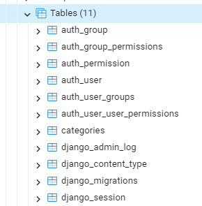

# Session 03 - Databases and Model

## 💛 Cấu hình kết nối Database

### 🔥 Cài đặt Database Engines cho dự án

Mặc định Django set sẵn SQLite, tuy nhiên Django cũng hỗ trợ các Database Engines phổ biến:

- PostgreSQL
- MariaDB
- MySQL
- Oracle

Chúng ta sẽ chọn `PostgreSQL` để cài đặt cho dự án bằng cách.


Sau khi activate môi trường ảo. Cài đặt driver

```bash
pip install psycopg2-binary
```

- **psycopg2-binary** là  một driver cần thiết để làm việc với `PostgreSQL` trong python. Phù hợp để chạy local trong quá trình development.
- **psycopg2** được ưu tiên sử dụng cho môi trường production. Nó cần thêm trình biên dịch C để chạy.


### 🔥 Cấu hình setting.py

Sửa biến `DATABASES` file `bikestore/setting.py` 

```python
DATABASES = {
    # 'default': {
    #     'ENGINE': 'django.db.backends.sqlite3',
    #     'NAME': BASE_DIR / 'db.sqlite3',
    # }
    "default": {
        "ENGINE": "django.db.backends.postgresql",
        "NAME": "DjangoPostgres", # Tên database
        "USER": "postgres", # User database
        "PASSWORD": "123456789",  # Pass database
        "HOST": "localhost",
        "PORT": "5432",
    }
}
```

Sau đó bạn thực hiện chạy lệnh

```bash
py manage.py migrate
```

Để hệ thống kết nối và khởi tạo CSDL mặc định cho dự án. Bạn kiểm tra Database sẽ thấy như hình sau:




## 💛 Tìm hiểu về Model

Trong Django, Model là một lớp Python đại diện cho một bảng trong cơ sở dữ liệu. Mỗi thuộc tính của model tương ứng với một trường trong bảng cơ sở dữ liệu. Mỗi model thường ánh xạ tới một bảng cơ sở dữ liệu.


Ví dụ bạn tạo model categories `categories/models.py`

```python
from django.db import models

# Create your models here.
class Categories(models.Model):
    # Trường category_name
    category_name = models.CharField(max_length=50)
    # Trường description
    description = models.CharField(max_length=500)
```

Khi bạn tạo table thì đồng nghĩa nó cũng tạo table categories và đồng bộ vào Database.

Bạn phải chắc chắn rằng đã thêm dòng này vào `INSTALLED_APPS` trong file settings.py

```python
INSTALLED_APPS = [
    'django.contrib.admin',
    'django.contrib.auth',
    'django.contrib.contenttypes',
    'django.contrib.sessions',
    'django.contrib.messages',
    'django.contrib.staticfiles',
    ##
    "categories.apps.CategoriesConfig", # thêm vào
    'categories',
    'home',
]
```
Để đổi đặt tên table theo ý mình. Bạn sửa model.py và thêm đoạn này vào.

```python
from django.db import models

# Create your models here.
class Categories(models.Model):

    # Đặt tên cho table
    # Còn không được tạo tự động
    class Meta:
        db_table = 'categories'

    # Trường category_name
    category_name = models.CharField(max_length=50)
    # Trường description
    description = models.CharField(max_length=500)
```

Tài liệu để học cách tạo Model với các trường và kiểu dữ liệu:

- Kiểu dữ liệu của trường: https://docs.djangoproject.com/en/5.0/ref/models/fields/#field-types
- Các Constraints: https://docs.djangoproject.com/en/5.0/ref/models/fields/#field-options
- Quan hệ giữa các Table: https://docs.djangoproject.com/en/5.0/ref/models/fields/#module-django.db.models.fields.related

Ví dụ

```python
from django.db import models

class Product(models.Model):
    # Định nghĩa khóa chính tự tăng. Nếu không được tạo tự động với tên id
    product_id = models.AutoField(primary_key=True)
    #product_name nvarchar(255) UNIQUE NOT NULL
    product_name = models.CharField(max_length=255, unique=True)
    # brand Có quan hệ với Model Brand
    brand = models.ForeignKey(Brand, on_delete=models.CASCADE)
    # category Có quan hệ với Model Category
    category = models.ForeignKey(Category, on_delete=models.CASCADE)
    #model_year SMALLINT NOT NULL
    model_year = models.SmallIntegerField()
    #price DECIMAL(18,2) DEFAULT 0
    price = models.DecimalField(max_digits=18, decimal_places=2, default=0)
    #price DECIMAL(4,2) DEFAULT 0
    discount = models.DecimalField(max_digits=4, decimal_places=2, default=0)
    #description nvarchar(max) NULL
    description = models.TextField(null=True)
    #created_at timestamp 
    created_at = models.DateTimeField(auto_now_add=True)
    #created_at timestamp  
    updated_at = models.DateTimeField(auto_now=True)
    # isActived BOOLEAN NOT NULL DEFAULT FALSE
    isActived = models.BooleanField(default=False)

    class Meta:
        db_table = 'products'
        # Danh sách các constraints
        constraints = [
            models.CheckConstraint(check=models.Q(price__gte=0), name='ck_products_price'),
            models.CheckConstraint(check=models.Q(discount__gte=0, discount__lte=70), name='ck_products_discount'),
        ]
```

Xem thêm về Model: https://docs.djangoproject.com/en/5.0/ref/models/


## 💛 Migration


Trong Django, `migration` được tạo ra để thực hiện các thay đổi đối với cấu trúc cơ sở dữ liệu của bạn - nói cách khác, nó là cách Django đề xuất để bạn sửa đổi cơ sở dữ liệu của mình theo cách an toàn và kiểm soát.

Mỗi khi bạn thay đổi định nghĩa của `models` trong ứng dụng Django của bạn, Django sẽ tạo ra một `migration` để áp dụng những thay đổi này vào cơ sở dữ liệu. Một `migration` có thể thêm hoặc xóa bảng, tạo hoặc xóa chỉ mục, hoặc thay đổi loại dữ liệu của các trường.

Để tạo `migration`, bạn sẽ sử dụng lệnh `makemigrations`:

```bash
#window
py manage.py makemigrations your_app_label
#MacOS, Ubuntu
python manage.py makemigrations your_app_label
```

Để xem lệnh SQL thuần mà Django sẽ thực hiện thay đổi lên Database thật khi áp dụng một migration cụ thể

```bash
#window
py manage.py sqlmigrate your_app_label migration_name
#MacOS, Ubuntu
python manage.py sqlmigrate your_app_label migration_name
```


 Điều này rất hữu ích nếu bạn muốn hiểu rõ hơn về những thay đổi mà Django sẽ thực hiện trên cơ sở dữ liệu của bạn

Để áp dụng `migration`, bạn sẽ sử dụng lệnh `migrate`:

```bash
#window
py manage.py migrate
#MacOS, Ubuntu
python manage.py migrate
```

Như vậy, `migration` giúp bạn quản lý cấu trúc cơ sở dữ liệu của mình một cách linh hoạt và an toàn. Nếu sai sót bạn có thể khôi phục (rollback) lại trạng thái trước khi thực hiện.


Để hủy một migration trong Django, bạn có thể sử dụng lệnh `migrate` kèm theo tên của ứng dụng và tên của migration mà bạn muốn quay lại trước đó. Cú pháp của lệnh như sau:

```bash
#window
py manage.py migrate your_app_label migration_name
#MacOS, Ubuntu
python manage.py migrate your_app_label migration_name
```


Nếu bạn muốn hủy tất cả các migration của một ứng dụng, bạn có thể chỉ cung cấp tên ứng dụng:

```bash
#window
py manage.py migrate your_app_label zero
#MacOS, Ubuntu
python manage.py migrate your_app_label zero
```

Lưu ý rằng, việc hủy migration có thể gây ra mất dữ liệu nếu migration bạn hủy đã thay đổi cấu trúc cơ sở dữ liệu. Hãy cẩn thận khi sử dụng lệnh này.


Tài liệu:

- makemigrations: https://docs.djangoproject.com/en/5.0/ref/django-admin/#django-admin-makemigrations
- migrate: https://docs.djangoproject.com/en/5.0/ref/django-admin/#migrate


Tiếp nối ví dụ trên bạn nhập lệnh

```bash
#window
py manage.py makemigrations categories
#MacOS, Ubuntu
python manage.py makemigrations categories
```

Kiểu như bạn đặt tên cho những thay đổi lên model.

Hệ thống sẽ sinh ra một file `categories/migrations/0001_initial.py`. Để lưu lại những thay đổi này.

Để áp dụng những thay đổi đó bạn chạy lệnh

```bash
#window
py manage.py migrate
#MacOS, Ubuntu
python manage.py migrate
```

Django sẽ tạo table `categories` vào trong Datatabase thật mà đã cấu hình trong `settings.py`


## 💛 Homeworks Guide

Thực hành tạo các Model

- brands
- products
- customers
- stores
- staffs
- orders
- order_items
- stocks
