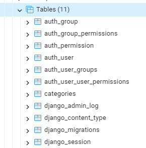

# Session 03 - Databases and Model

## 💛 Cấu hình kết nối Database

### 🔥 Cài đặt Database Engines cho dự án

Mặc định Django set sẵn SQLite, tuy nhiên Django cũng hỗ trợ các Database Engines phổ biến:

- PostgreSQL
- MariaDB
- MySQL
- Oracle

Chúng ta sẽ chọn `PostgreSQL` để cài đặt cho dự án bằng cách.


Sau khi activate môi trường ảo. Cài đặt driver

```bash
pip install psycopg2-binary
```

- **psycopg2-binary** là  một driver cần thiết để làm việc với `PostgreSQL` trong python. Phù hợp để chạy local trong quá trình development.
- **psycopg2** được ưu tiên sử dụng cho môi trường production. Nó cần thêm trình biên dịch C để chạy.


### 🔥 Cấu hình setting.py

Sửa biến `DATABASES` file `bikestore/setting.py` 

```python
DATABASES = {
    # 'default': {
    #     'ENGINE': 'django.db.backends.sqlite3',
    #     'NAME': BASE_DIR / 'db.sqlite3',
    # }
    "default": {
        "ENGINE": "django.db.backends.postgresql",
        "NAME": "DjangoPostgres", # Tên database
        "USER": "postgres", # User database
        "PASSWORD": "123456789",  # Pass database
        "HOST": "localhost",
        "PORT": "5432",
    }
}
```

Sau đó bạn thực chạy lệnh

```bash
py manage.py migrate
```

Để hệ thống kết nối và khởi tạo CSDL mặc định cho dự án. Bạn kiểm tra Database sẽ thấy như hình sau:




## 💛 Giới thiệu về Model trong Django

Trong Django, Model là một lớp Python đại diện cho một bảng trong cơ sở dữ liệu. Mỗi thuộc tính của model tương ứng với một trường trong bảng cơ sở dữ liệu. Mỗi model thường ánh xạ tới một bảng cơ sở dữ liệu.


Dưới đây là một ví dụ về model đơn giản trong Django
