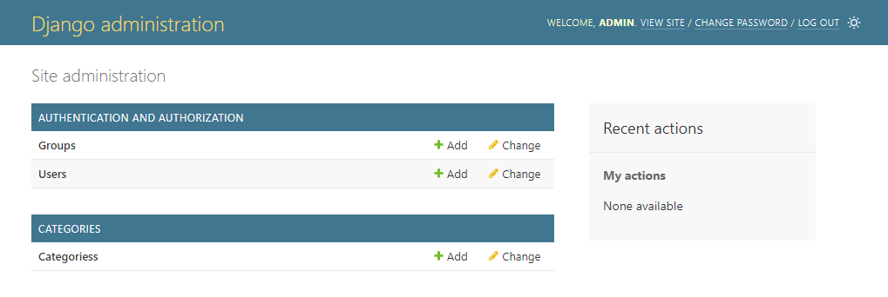
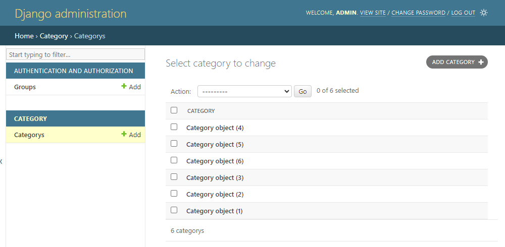
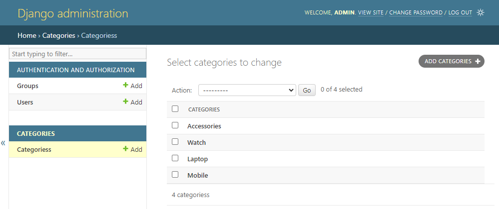
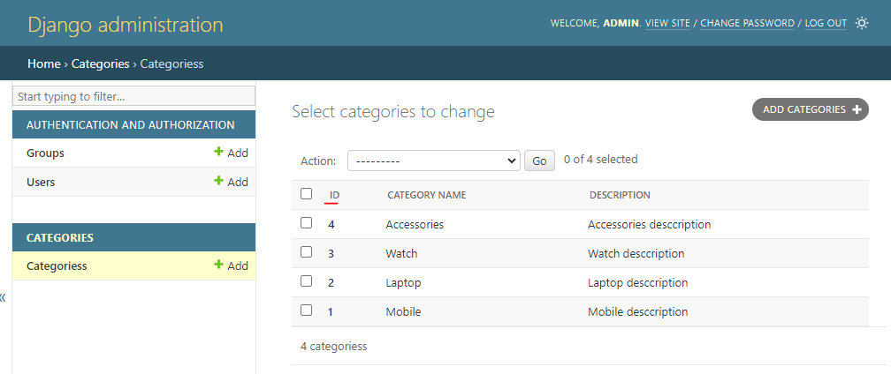
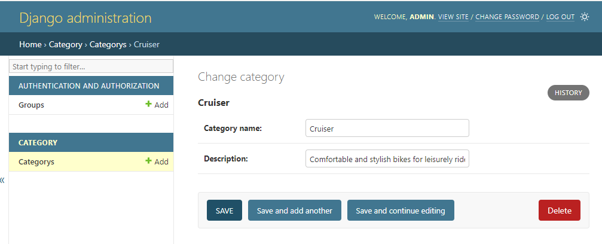
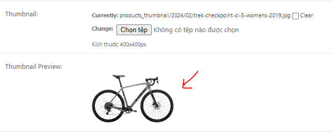

# Session 04 - Django Admin 

Django Admin là một công cụ được tích hợp sẵn trong Django, giúp bạn quản lý dữ liệu một cách hiệu quả. Nó cung cấp một giao diện quản trị cho các model, giúp bạn và những người sử dụng khác có thể thêm, sửa, xoá dữ liệu.

Django Admin cung cấp các tính năng như:
- Quản lý người dùng: Django Admin cho phép bạn quản lý người dùng, nhóm và quyền.
- Quản lý dữ liệu: Django Admin cho phép bạn thực hiện các thao tác trên các model, như thêm mới, chỉnh sửa, xoá.
- Tuỳ biến: Django Admin cho phép bạn tuỳ chỉnh giao diện quản trị, như thay đổi cách hiển thị dữ liệu, thêm các trường tìm kiếm, lọc.


## 💛 Admin site

Để sử dụng Django Admin, bạn cần tạo một tài khoản admin bằng lệnh `createsuperuser`, sau đó bạn có thể truy cập vào giao diện quản trị bằng cách truy cập vào đường dẫn `/admin` trên trang web của bạn.

Đường dẫn trên được cấu hình tại `bikestore/url.py`

```python
urlpatterns = [
    path('', include("home.urls")),
    # đường dẫn đến trang admin
    path('admin/', admin.site.urls), 
]
```

Truy cập vào bạn sẽ thấy form login như sau


## 💛 Admin User

Để đăng nhập vào được Django Admin bạn phải khởi tạo một tài khoản quản trị có quyền cao nhất (root user)

```bash
#Window
py manage.py createsuperuser
# MAC, Ubuntu
python manage.py createsuperuser
```

Sau đó bạn điền `username`, `email` và `password` để đăng ký Supper User.

Sau khi login sẽ có giao diện Django Admin như sau


## 💛 Đăng ký một APP vào Admin

Mặc định khi tạo một app thì nó đã có sẵn file `admin.py`, bạn edit file này để đăng ký Model hiển thị trong giao diện của Admin.

```python
from django.contrib import admin
# Nạp model vào
from .models import Category
# Register your models here.
# Sử dụng hàm admin.site.register để đăng ký Model 
admin.site.register(Category)
```

Sau đó bạn restart lại server và kiểm tra trong giao diện admin sẽ thấy Model Category được thêm vào.



Kích vào chi tiết bạn sẽ thấy được mặc định như hình dưới đây



Danh sách tên các danh mục, nhưng nó hiển thị mặc định như hình nhìn không OK lắm. Bạn có thể tùy chỉnh lại bằng edit Model  như sau:

```python
from django.db import models

# Create your models here.
# Tạo bảng Category
class Category(models.Model):
    #Để hiện thị tên ở trong list Dashboard
    def __str__(self):
        return self.category_name
    
    class Meta:
        db_table = 'bs_categories'
        ordering = ['category_name']

    category_name = models.CharField(max_length=50) # Trường category_name
    description = models.CharField(max_length=500) # Trường description
```

Sau đó bạn sẽ thấy được tên danh mục như hình sau:




Như vậy bạn đã đăng ký thành công một Model trong giao diện Admin và nó có đầy đủ các tính năng cơ bản CURD (Xem, Thêm, Sửa, Xóa).


## 💛 Custom hiển thị cho App trong Admin

Tài liệu chi tiết xem: https://docs.djangoproject.com/en/5.0/ref/contrib/admin/

Dưới đây là một số thuộc tính quan trọng để tùy chỉnh hiển thị trong trang quản trị Django, cùng với một ví dụ chung:

1. **list_display**: Một tuple chứa tên các trường mà bạn muốn hiển thị trên trang danh sách.
2. **list_filter**: Một tuple chứa tên các trường mà bạn muốn sử dụng làm bộ lọc.
3. **search_fields**: Một tuple chứa tên các trường mà bạn muốn tìm kiếm.
4. **ordering**: Một tuple chứa tên các trường mà bạn muốn sắp xếp theo.
5. **fields**: Một tuple hoặc list chứa tên các trường mà bạn muốn hiển thị trên form chỉnh sửa.
6. **exclude**: Một tuple hoặc list chứa tên các trường mà bạn không muốn hiển thị trên form chỉnh sửa.
7. **readonly_fields**: Một tuple hoặc list chứa tên các trường mà bạn muốn đặt ở chế độ chỉ đọc.
8. **formfield_overrides**: Ghi đè lại cách hiển thị của Field


Ví dụ, nếu bạn muốn tùy chỉnh hiển thị cho model `MyModel`, bạn có thể tạo một lớp `ModelAdmin` như sau:

```python
from django.contrib import admin

class MyModelAdmin(admin.ModelAdmin):
    list_display = ('field1', 'field2', 'field3')
    list_filter = ('field1', 'field2')
    search_fields = ('field1', 'field2')
    ordering = ('field1',)
    fields = ('field1', 'field2', 'field3')
    exclude = ('field4',)
    readonly_fields = ('field5',)

admin.site.register(MyModel, MyModelAdmin)
```

Trong đó, `field1`, `field2`, `field3`, `field4`, và `field5` là các trường trong model `MyModel`.


### 🔥 Custom hiển thị lưới danh sách

Trong hình trên, bạn thấy mặc định nó chỉ có một cột thông tin, bạn có thể cấu hình để hiển thị thêm các cột theo ý muốn.

Edit `categories/admin.py`. Thêm một `class CategoryAdmin` như sau:


```python
from django.contrib import admin
#Đứng thư mục hiện tại là dấu ., lấy file  models, dùng Model Category
from .models import Category

# Cấu hình các trường hiển thị ở trang danh sách
class CategoryAdmin(admin.ModelAdmin):

  list_display = ("id", "category_name", "description",)

    #...
# Register your models here.
admin.site.register(Category, CategoryAdmin)
```

Kết quả được như hình. 



Mặc định nó lấy cột đầu tiên ID để tạo liên kết xem chi tiết một record.




### 🔥 Custom hiển thị Form

#### 🔸 Thêm dòng ghi chú cho input nhập liệu

Bạn thêm tùy chọn `help_text` vào Field trong Model

```python
is_active = models.BooleanField(default=True,help_text='Chọn nếu sản phẩm đang bán')
```

#### 🔸 Thay đổi thứ tự xuất hiện các inputs

Bạn có thể cấu hình ở Lớp ModelAdmin trong file `admin.py`


```python
from django.contrib import admin

class MyModelAdmin(admin.ModelAdmin):
    fields = ('field1', 'field2', 'field3')

admin.site.register(MyModel, MyModelAdmin)
```

Với field1, field2, field3 là tên các fields


Hoặc bạn thay đổi thứ tự khi khái báo các Fields trong Model cũng có tác dụng tương tự.


### 🔥 Ẩn một trường khỏi trong Admin

Cách 1: Liệt kê trường vào tùy chọn `exclude`

```python
from django.contrib import admin

class MyModelAdmin(admin.ModelAdmin):
    exclude = ('field1',)

admin.site.register(MyModel, MyModelAdmin)
```

Cách 2: Cấu hình Field trong Model, set `editable=True`

```python
class Model(models.Model):
    is_delete = models.BooleanField(default=False,editable=False)
```


### 🔥 Thêm Trường Upload hình ảnh

Ví dụ Ở Model Product bạn thêm trường `thumbnail` để upload hình đại diện cho sản phẩm

Bước 1: `Model Product` bạn thêm trường `thumbnail`

```python
thumbnail = models.ImageField(upload_to='thumbnail/%Y/%m/')
```

Bước 2: Cài thư viện Pillow vào môi trường ảo nếu chưa cài

```bash
py -m pip install Pillow
```

Bước 3: Cấu hình MEDIA_ROOT

`MEDIA_ROOT` là cấu hình đường dẫn tuyệt đối cho các tập tin tải lên bởi người dùng trong Django.

Tất cả các tệp tin tải lên dự kiến sẽ lưu hết vào `bikestore/static/uploads/`

Và tùy vào mỗi app, bạn có nhu cấu phân loại ra thành các thư mục con nữa thì bạn cấu hình tiếp trong tùy chọn `upload_to` khi định nghĩa file `ImageField`

Sửa lại file `settings.py` thêm biến `MEDIA_ROOT` gần biến `STATIC_URL`

```python
MEDIA_ROOT = os.path.join(BASE_DIR, 'bikestore/static/uploads/')
```

Khi đó URL tuyệt đối của một tệp tin sẽ là

```python
MEDIA_ROOT + upload_to
```

Chúng ta sẽ tìm hiểu các để re-size kích thước và giới hạn dung lượng tệp tin tải lên trong bài học sau.

Bước 4: Cấu hình MEDIA_URL

Đây là biến cấu hình URL truy cập đến tập tin trong các View.

```python
MEDIA_URL = '/bikestore/static/uploads/'
```

Bước 5: Khai báo URL static

Sửa file `bikestore/urls.py`

```python
from django.conf import settings
from django.conf.urls.static import static

urlpatterns = [
    # các URL khác...
] + static(settings.MEDIA_URL, document_root=settings.MEDIA_ROOT)
```

Bước 5: Sử dụng URL

Sau khi bạn khai báo đủ các bước trên, chúng ta sẽ nhận được url của hình ảnh

Trong Python: Tên trường chấm thêm url sau.

```python
product = Product.objects.get(id=1)
thumbnail_url = product.thumbnail.url
```

Trong các views

```html

```

Ví dụ bạn muốn hiển thị hình ảnh thumbnail đã up load ở Form Edit sản phẩm



bạn thêm đoạn này vào ModelAdmin

```python
from django.utils.html import mark_safe

class ProductAdmin(models.ModelAdmin):

    #Hiển thị hình ảnh Thumbnail đã upload
    readonly_fields = ['thumbnail_preview',]

    # Tùy chỉnh hiển thị thêm hình ảnh đã upload
    def thumbnail_preview(self, obj):
        return mark_safe('''
                     
                     '''.format(img_url=obj.thumbnail.url, img_alt=obj.product_name))
    thumbnail_preview.short_description = 'Thumbnail Preview'

```


### 🔥 Phân trang danh sách

Bạn thêm vào ModelAdmin hàm này để ghi đè lại phương thức phân trang

```python
class ProductAdmin(admin.ModelAdmin):
    #Tùy biến phân trang cho lưới danh sách
    def get_paginator(self, request, queryset, per_page, orphans=0, allow_empty_first_page=True):
         # Tùy chỉnh số lượng mục trên mỗi trang
        per_page = 15
        return super().get_paginator(request, queryset, per_page, orphans, allow_empty_first_page)

```

## 💛 Admin actions

Trong Django, `Admin Action` là một chức năng mạnh mẽ cho phép bạn thực hiện các thao tác trên một tập hợp các đối tượng được chọn từ trang danh sách thay đổi.

Bạn có thể tự định nghĩa một action để xử lý một tác vụ gì đó.

Xem chi tiết: https://docs.djangoproject.com/en/5.0/ref/contrib/admin/actions/

### 🔥 Tạo một Action

Ví dụ bạn cần tạo một action Soft Delete sản phẩm

Bạn edit file `admin.py` của app product. Thêm định nghĩa hàm xử lý.


```python
from django.contrib import admin
from .models import Product

#Định nghĩa hàm xử lý action
# Thêm sản phẩm vào giỏ rác
@admin.action(description="Delete this item to recyclebin")
def soft_delete(modeladmin, request, queryset):
    queryset.update(is_delete=True)


#Định nghĩa hàm xử lý action
# Khôi phục sản phẩm từ giỏ rác
@admin.action(description="Restore this item to recyclebin")
def restore_recyclebin(modeladmin, request, queryset):
    queryset.update(is_delete=False)


class ProductAdmin(admin.ModelAdmin):
    #Đăng ký hàm vào biến actions
    actions = [soft_delete,restore_recyclebin]
```

## 💛 Admin documentation generator

Là cách tạo ghi chú theo chuẩn của Django để nó tự động tạo ra document gợi ý code.

Xem chi tiết: https://docs.djangoproject.com/en/5.0/ref/contrib/admin/admindocs/