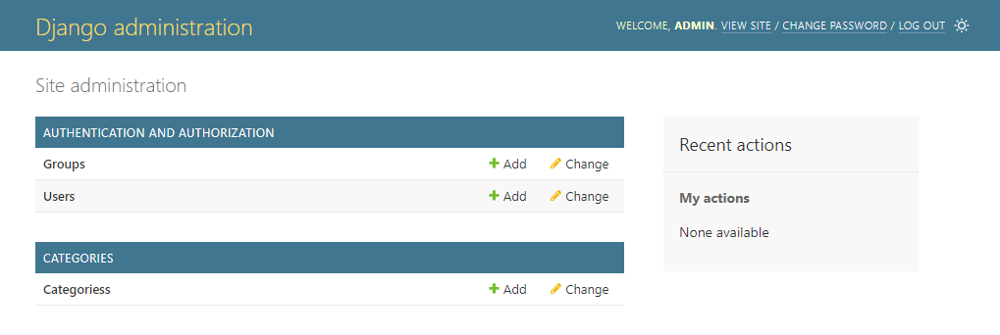
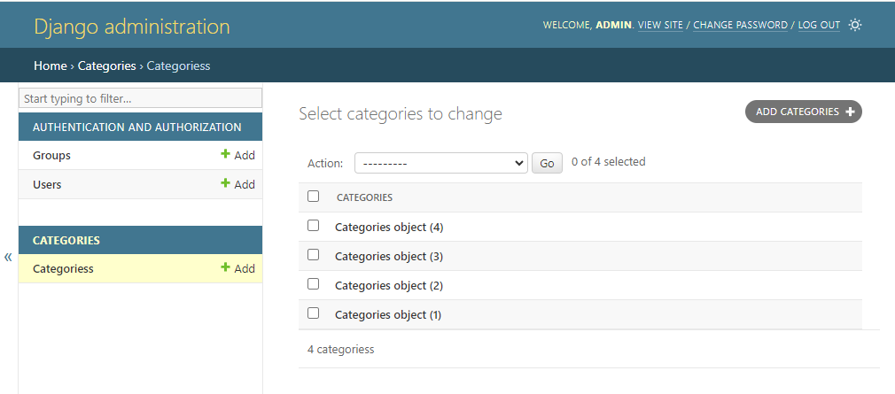
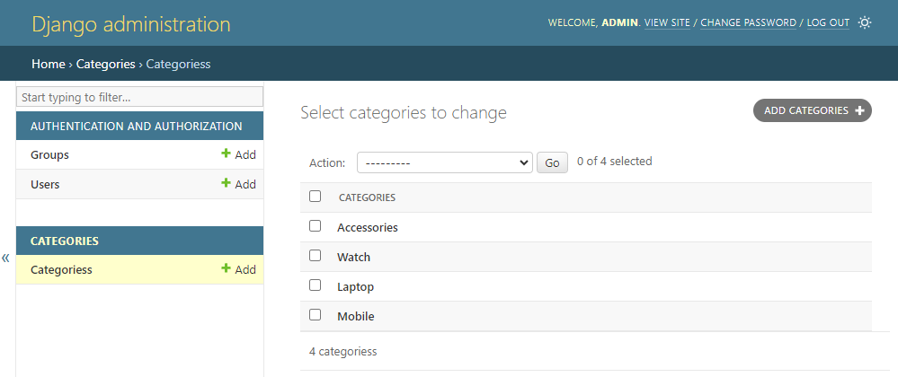
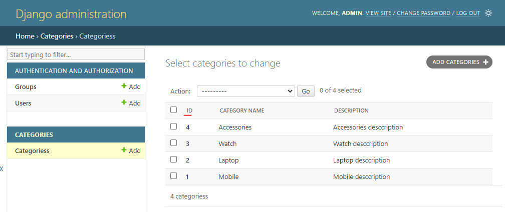
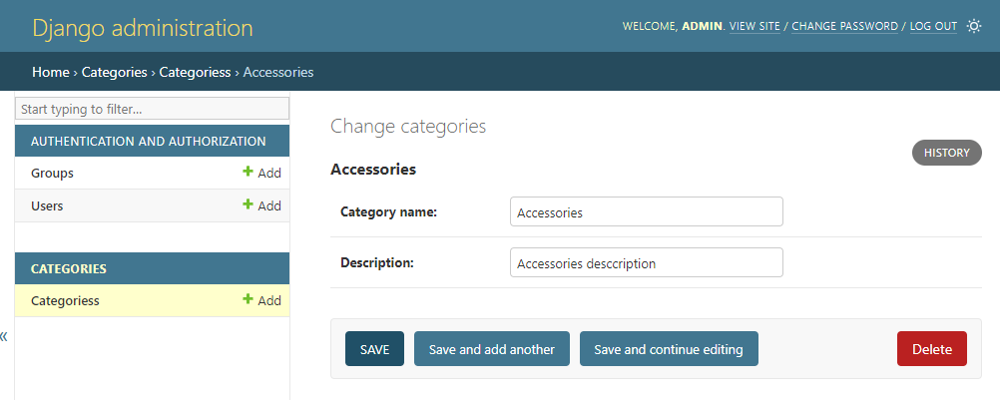

# Session 04 - Django Admin 

Django Admin là một công cụ được tích hợp sẵn trong Django, giúp bạn quản lý dữ liệu một cách hiệu quả. Nó cung cấp một giao diện quản trị cho các model, giúp bạn và những người sử dụng khác có thể thêm, sửa, xoá dữ liệu.

Django Admin cung cấp các tính năng như:
- Quản lý người dùng: Django Admin cho phép bạn quản lý người dùng, nhóm và quyền.
- Quản lý dữ liệu: Django Admin cho phép bạn thực hiện các thao tác trên các model, như thêm mới, chỉnh sửa, xoá.
- Tuỳ biến: Django Admin cho phép bạn tuỳ chỉnh giao diện quản trị, như thay đổi cách hiển thị dữ liệu, thêm các trường tìm kiếm, lọc.


## 💛 Admin site

Để sử dụng Django Admin, bạn cần tạo một tài khoản admin bằng lệnh `createsuperuser`, sau đó bạn có thể truy cập vào giao diện quản trị bằng cách truy cập vào đường dẫn `/admin` trên trang web của bạn.

Đường dẫn trên được cấu hình tại `bikestore/url.py`

```python
urlpatterns = [
    path('', include("home.urls")),
    # đường dẫn đến trang admin
    path('admin/', admin.site.urls), 
    path('categories/', include('categories.urls')),
    
]
```

Truy cập vào bạn sẽ thấy form login như sau


## 💛 Admin User

Để đăng nhập vào được Django Admin bạn phải khởi tạo một tài khoản quản trị có quyền cao nhất (root user)

```bash
#Window
py manage.py createsuperuser
# MAC, Ubuntu
python manage.py createsuperuser
```

Sau đó bạn điền `username`, `email` và `password` để đăng ký Supper User.

Sau khi login sẽ có giao diện Django Admin như sau


## 💛 Đăng ký một APP vào Admin

Mặc định khi tạo một app thì nó đã có sẵn file `admin.py`, bạn edit file này để đăng ký Model hiển thị trong giao diện của Admin.

```python
from django.contrib import admin
# Nạp model vào
from .models import Categories
# Register your models here.
# Sử dụng hàm admin.site.register để đăng ký Model 
admin.site.register(Categories)
```

Sau đó bạn restart lại server và kiểm tra trong giao diện admin sẽ thấy Module Categories được thêm vào.



Kích vào chi tiết bạn sẽ thấy được mặc định như hình dưới đây



Danh sách tên các danh mục, nhưng nó hiển thị mặc định như hình nhìn không OK lắm. Bạn có thể tùy chỉnh lại bằng edit Model  như sau:

```python
from django.db import models

# Create your models here.
# Tạo bảng Categories
class Categories(models.Model):
    #Để hiện thị tên ở trong list Dashboard
    def __str__(self):
        return self.category_name
    
    class Meta:
        db_table = 'categories'

    category_name = models.CharField(max_length=50) # Trường category_name
    description = models.CharField(max_length=500) # Trường description
```

Sau đó bạn sẽ thấy được tên danh mục như hình sau:




Như vậy bạn đã đăng ký thành công một Model trong giao diện Admin và nó có đầy đủ các tính năng cơ bản CURD (Xem, Thêm, Sửa, Xóa).


### Custom hiển thị cho App trong Admin

Tài liệu chi tiết xem: https://docs.djangoproject.com/en/5.0/ref/contrib/admin/

Trong hình trên, bạn thấy mặc định nó chỉ có một cột thông tin, bạn có thể cấu hình để hiển thị thêm các cột theo ý muốn.

Edit `categories/admin.py`. Thêm một `class CategoriesAdmin` như sau:


```python
from django.contrib import admin
from .models import Categories

# Cấu hình các trường hiển thị ở trang danh sách
class CategoriesAdmin(admin.ModelAdmin):
  list_display = ("id", "category_name", "description",)

# Register your models here.
admin.site.register(Categories)
```

Kết quả được như hình. 



Mặc định nó lấy cột đầu tiên ID để tạo liên kết xem chi tiết một record.




## 💛 Admin actions

## 💛 Admin documentation generator