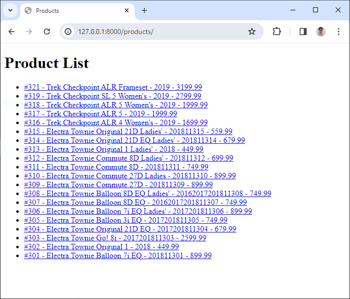

# Session 02 - URLs and views


## 💛 Tìm hiểu về View trong Django

Trong Django, **View** là một hàm Python hoặc một phương thức (trong trường hợp bạn sử dụng class-based views) nhận một web request và trả về một web response. 

Response có thể là nội dung HTML của một trang web, hoặc một redirect, hoặc một lỗi 404, hoặc một tài liệu XML, hoặc một hình ảnh... hoặc bất cứ thứ gì. View chứa bất kỳ logic tùy ý nào cần thiết để trả về response đó.

Django sử dụng mô hình MVT (Model-View-Template) thay vì mô hình MVC (Model-View-Controller) truyền thống. Trong Django, View được cọi như là controller và teamplate như là view trong mô hình MVC.

Theo cách triển khai của Django, view sẽ thể hiện dữ liệu trả về cho người dùng. Nó không chỉ là cách hiển thị dữ liệu như thế nào, mà còn là những dữ liệu nào được hiển thị.

Cùng tìm hiểu `View` qua một ví dụ

Bạn sửa lại file `product/view.py` thành như sau


```python
from django.http import HttpResponse

def productList(request):
    html = '<html><body><h1>Categories List</h1></body></html>';
    # Response lại cho client chuỗi HTML
    # status=200 là trạng thái thành công mặc định
    return HttpResponse(html, status=200)

def productDetail(request, id):
    html = '<html><body><h1>Detail Product</h1></body></html>';
    # Response lại cho client chuỗi HTML
    # status=200 là trạng thái thành công mặc định
    return HttpResponse(html, status=200)
```

Bạn có thể hiểu hàm trên xử lý logic để trả về kết quả cho client.

- Đầu vào là request
- Đầu ra là HttpResponse

Câu hỏi đặt ra là: Làm sao chúng ta có thể xem được view này ? 

Hay nói dễ hiểu: Là làm sao để xem được đoạn code trên hiển thị ra như thế  nào ?

==> Chúng ta cần đến một khái niệm gọi là `URL`. Trong một số framework khác nó còn biết đến với một cái tên là `Route` (Định tuyến)

---


## 💛 Tìm hiểu về Request, Response

Trước khi đi vào tìm hiểu `URLs` chúng ta cần làm rõ khái niệm `Request, Response`


Cách hoạt động ứng dụng web:

1. **Client** gửi một **Request** đến Server. Request này bao gồm:
   - **Method**: Phương thức HTTP như GET, POST, PUT, DELETE, etc.
   - **Resources**: Đường dẫn tới tài nguyên trên Server mà Client muốn truy cập.
   - **Headers**: Thông tin bổ sung về Request.
   - **Content** (tùy chọn): Dữ liệu mà Client muốn gửi đến Server (thường có trong các Request POST hoặc PUT).

2. Khi nhận được Request, **Server** sẽ xử lý nó (như được biểu diễn bởi `Process()` trong hình).

3. Sau khi xử lý xong, Server sẽ gửi lại một **Response** cho Client. Response này bao gồm:
   - **Status Code**: Mã trạng thái HTTP như 200 (OK), 404 (Not Found), 500 (Internal Server Error), etc.
   - **Headers**: Thông tin bổ sung về Response.
   - **Content** (tùy chọn): Dữ liệu mà Server muốn gửi lại cho Client.


### 🔥 Requests

Trong ví dụ về `app category` trên bạn thấy trong hàm `index(request)` nhận vào tham số `request`

Request mang theo một trong các methods: GET, POST, PUT, DELETE. Mặc định được hiểu là GET.

Dựa vào method này `view.py` sẽ xử lý các logic tương ứng sau đó trả lại kết quả cho client thông qua response.

Trong Django, `HttpRequest` là một đối tượng được tạo ra cho mỗi yêu cầu HTTP nhận được bởi ứng dụng của bạn. Dưới đây là một số thuộc tính và phương thức quan trọng của `HttpRequest`:

1. **Thuộc tính `method`**: Đây là một chuỗi biểu diễn phương thức HTTP của yêu cầu (ví dụ: 'GET', 'POST').

2. **Thuộc tính `path`**: Đây là một chuỗi biểu diễn đường dẫn URL của yêu cầu, không bao gồm tên miền.

3. **Thuộc tính `GET`**: Đây là một đối tượng chứa tất cả các tham số GET của yêu cầu.

4. **Thuộc tính `POST`**: Đây là một đối tượng chứa tất cả các tham số POST của yêu cầu.

5. **Thuộc tính `COOKIES`**: Đây là một đối tượng chứa tất cả các cookie được gửi cùng với yêu cầu.

6. **Phương thức `is_ajax()`**: Phương thức này trả về `True` nếu yêu cầu được tạo ra bởi một hàm JavaScript `XMLHttpRequest`.

7. **Phương thức `is_secure()`**: Phương thức này trả về `True` nếu yêu cầu được thực hiện qua HTTPS.

Dưới đây là một ví dụ về cách sử dụng một số thuộc tính và phương thức của `HttpRequest`:

```python
def some_view(request):
    # Lấy phương thức HTTP
    method = request.method

    # Lấy đường dẫn URL
    path = request.path

    # Lấy tham số GET 'param'
    param = request.GET.get('param', '')

    # Kiểm tra xem yêu cầu có phải là AJAX hay không
    is_ajax = request.is_ajax()

    # Kiểm tra xem yêu cầu có phải là HTTPS hay không
    is_secure = request.is_secure()

    ...
```

### 🔥 Response

Đọc thêm về django.http:
- [django.http](django.http.md)
- https://docs.djangoproject.com/en/5.0/ref/request-response/#django.http.HttpResponse


#### 🔹HttpResponse

Ví dụ 1: Trả lại một chuỗi. Có thể là html.

```python
from django.http import HttpResponse

#Hiển thị danh sách sản phẩm
def productList(request):
    # Create a response
    response = HttpResponse(content="Here's the text of the web page.", status_code=200)
    #Nối thêm vào content trả về
    response.write("<p>Here's the text of the web page.</p>")
    # Return the response
    return response
```

#### 🔹 SimpleTemplateResponse

Là một lớp cơ bản giúp bạn `response` lại cho client một file view ở dạng tập tin `.html`

Xem chi tiết: https://docs.djangoproject.com/en/5.0/ref/template-response/

#### 🔹 TemplateResponse

Là lớp kế thừa từ `SimpleTemplateResponse` và mở  rộng tính năng hơn.

Giúp bạn `response` lại client một `template` mạnh mẽ hơn.

Ví dụ: bạn sửa file `product/view.py`

```python
from django.template.response import TemplateResponse

#Hiển thị danh sách sản phẩm
def productList(request):
    context = {}
    # Create a response
    response = TemplateResponse(request, "product_list.html", context)
    # Return the response
    return response

#Hiển thị chi tiết sản phẩm
def productDetail(request, id):
    context = {}
    # Create a response
    response = TemplateResponse(request, "product_detail.html",context)
    
    # Return the response
    return response
```

Trong đó 2 file `product_list.html` và `product_detail.html` được tại ra tại đường dẫn `product/templates/`

```html
├── product
    ├── templates
    │   ├── product_list.html
    │   └── product_detail.html
```

Chúng ta sẽ tìm hiểu chi tiết hơn trong phần Template


#### 🔹 Shorcut Render

```python
from django.shortcuts import render
from .models import Product

#Hiển thị danh sách sản phẩm
def productList(request):
    context = {}
    # Create a response
    response = TemplateResponse(request, "product_list.html", context)
    # Return the response
    return response

# nếu không tìm thấy sản phẩm thì trả về page 404
def detail(request, id):
    product = get_object_or_404(Product, pk=id)
    return render(request, "product_detail.html", {"product": product})
```

#### 🔹 JsonResponse

Ví dụ

```python
from django.http import JsonResponse

def some_view(request):
    data = {
        'name': 'John',
        'age': 30,
        'city': 'New York'
    }
    return JsonResponse(data)
```

Chi tiết: https://docs.djangoproject.com/en/5.0/ref/request-response/#jsonresponse-objects

#### 🔹 FileResponse

`FileResponse` là một lớp trong Django giúp bạn gửi một tệp như một phản hồi HTTP. Điều này rất hữu ích khi bạn muốn cho phép người dùng tải xuống một tệp từ máy chủ của bạn.

Dưới đây là một ví dụ về cách sử dụng `FileResponse` để gửi một tệp như một phản hồi HTTP:

```python
from django.http import FileResponse

def some_view(request):
    file_path = '/path/to/your/file'
    response = FileResponse(open(file_path, 'rb'))
    return response
```

Trong đoạn mã trên, `FileResponse` nhận một đối tượng file mở trong chế độ đọc nhị phân (`'rb'`) làm tham số và trả về một phản hồi HTTP với nội dung là nội dung của tệp. Khi bạn truy cập vào view `some_view`, trình duyệt sẽ tải xuống tệp tại `file_path`.

---

## 💛 Tìm hiểu về URL trong Django

Trong Django, URL đóng vai trò định tuyến phản hồi lại request của người dùng.

Ví dụ: Khi bạn nhập vào URL là:

- '/': Thì nó sẽ hiển thị trang chủ
- '/products': Thì nó sẽ hiển thị trang danh mục sản phẩm
- '/products/1': Thì nó sẽ hiển thị chi tiết 1 sản phẩm


Tức là nó lấy phần `view` hiển thị tương ứng với phần `url` hiện tại mà `request` người dùng gửi lên.


Dưới đây là một số thông tin cơ bản về URL trong Django:

1. **URL Dispatcher**: Django sử dụng một hệ thống URL dispatcher để điều hướng các yêu cầu web đến view thích hợp dựa trên URL. Dispatcher sẽ so khớp URL của yêu cầu HTTP với một danh sách các mẫu URL mà bạn đã định nghĩa trước.

2. **URLConf**: Trong Django, bạn định nghĩa các mẫu URL trong một tệp Python được gọi là URLConf, thường là tệp `urls.py`. Mỗi mẫu URL bao gồm một chuỗi mô tả mẫu và một view sẽ được gọi khi mẫu được khớp.

3. **View**: Khi một mẫu URL được khớp, Django sẽ gọi view tương ứng với một số thông tin về yêu cầu, như các tham số được trích xuất từ URL. View sau đó sẽ xử lý yêu cầu và trả về một HTTP response.

4. **Namespaces URL**: Django hỗ trợ namespaces URL, cho phép bạn tổ chức tốt hơn các URL của ứng dụng. Điều này rất hữu ích khi bạn có nhiều ứng dụng Django và muốn tránh xung đột tên URL.

5. **Reverse URL Matching**: Django cung cấp một hệ thống reverse URL matching, cho phép bạn xây dựng URL dựa trên tên của chúng. Điều này giúp mã của bạn dễ bảo dưỡng hơn, vì bạn không cần cập nhật URL ở nhiều nơi mỗi khi bạn thay đổi mẫu URL.

Toàn bộ cấu hình URL của Django được đặt tại file `bikestore/urls.py`.

```python
#...Phần import thư viện

#Biến này chưa danh sách các URLs có trong project
urlpatterns = [
    path('', include("home.urls")),
    path('admin/', admin.site.urls),
    
] + static(settings.MEDIA_URL, document_root=settings.MEDIA_ROOT)
```

Ngoài ra, trong mỗi app, chúng CÓ THỂ có từng file `url.py` để cấu hình `segment` riêng cho từng app.

### 🔥 Định nghĩa URL mới URLconf

Bước 1: Định nghĩa URL cho app

Mặc định khi tạo app file `urls.py` không được tạo sẵn. Bạn cần tạo ra file này cho mỗi app.

File `product/urls.py`

```python
from django.urls import path
from . import views

#Biến này cấu hình danh sách các urls nội bộ của app
urlpatterns = [
    #ex /products/
    path('', views.productList, name='product_list'),
    #ex /products/1/
    path('<int:id>/', views.productDetail, name='product_detail'),
]
```


Bước 2: Khai báo URL của app với Django

Bạn sửa file `bikestore/urls.py` bổ sung vào biến `urlpatterns` như sau:

```python
from django.contrib import admin
from django.urls import include, path

urlpatterns = [
    path('', include("home.urls")),
    path('admin/', admin.site.urls),
    #Thêm dòng này vào
    #Nạp file urls ở trong thư mục product
    path('products/', include('product.urls')),
    
] + static(settings.MEDIA_URL, document_root=settings.MEDIA_ROOT)
```
Khi bạn cấu hình 2 bước trên thì đường dẫn URL được nối thành.

```python
#URL này gọi URL tĩnh
products/ + Kí tự rỗng = products/
#URL với trường id động, chỉ chấp nhận kiểu int
products/ + <int:id>/ = products/<int:id>/
'''
products/1 --> Khớp
products/anc --> Không khớp
'''
```

Bạn truy cập đến URL: `http://127.0.0.1:8000/products`

Bạn sẽ thấy nội dung của phần `view` được hiện thị tương ứng với `url` đã khai báo.


### 🔥 URL dispatcher

Là cách mà chúng ta định nghĩa URL chính xác theo mong muốn để hiển thị `view`.

Xem thêm: https://docs.djangoproject.com/en/5.0/topics/http/urls/#example

Ví dụ: URL tĩnh

```python
"lien-he"
"hoi-dap"
"gioi-thieu"
```

Mỗi `URL` trên tương tứng với một `view` cụ thể

Khi đó bạn sẽ khai báo URL

```python
 path('lien-he/', include("contact.urls")),
 path('hoi-dap/', include("faq.urls")),
 path('gioi-thieu/', include("company.urls")),
```

Ví dụ: URL động

```python
"users/ngocnhan"
"users/vantai"
"users/quoctuan"
"users/ngocnhan"
#Hoặc
"products/1"
"products/2"
"products/3"
"products/3"
#Hoặc
"tin-tuc/apple-vua-ra-mat-iphone-15-pro-max"
"tin-tuc/vai-tro-cua-ai-trong-doi-song"
#Hoặc
"photos/2003"
"photos/2004"
"photos/2005"
```

Khi đó bạn sẽ khai báo trong `urls.py` các app tương ứng 


```python
path('<str:username>', include("user.urls"))
path('<int:id>', include("product.urls"))
path('<slug:slug>', include("post.urls"))
```

Hoặc sử dụng `regular expressions`

```python
from django.urls import path, re_path

re_path(r"^(?P<year>[0-9]{4})/$", include("photo.urls"))
```
Xem thêm: https://docs.djangoproject.com/en/5.0/topics/http/urls/#using-regular-expressions


### 🔥 Path converters

Trong django có các loại:
- **str**: khớp với tất cả kí tự, ngoài trị kí tự rỗng và "/"
- **int**: khớp với số nguyên dương 0-9, trả về kiểu số.
- **slug**: khớp với tất cả kí tự và số ASCII, và dấu gạch nối -, gạch dưới _. Ví dụ: building-your-1st-django-site
- **uuid**: khớp với định dạng UUID. Ví dụ: 075194d3-6885-417e-a8a8-6c931e272f00
- **path**: khớp với tất cả kí tự không rỗng, bao gồm cả "/"

Ngoài ra bạn có thể tự đăng ký cho mình một `Path converter` riêng.

Chi tiết xem tại: https://docs.djangoproject.com/en/5.0/topics/http/urls/#registering-custom-path-converters


### 🔥 URL NameSpaces


Trong Django, URL namespaces là một tính năng mạnh mẽ giúp bạn tổ chức và modularize cấu hình URL của mình. URL namespaces cho phép bạn nhóm các mẫu URL liên quan dưới một tiền tố chung, giúp quản lý và tham chiếu chúng dễ dàng hơn.

Dưới đây là một số điểm chính về URL namespaces trong Django:

1. **Phân biệt các URL**: URL namespaces giúp bạn phân biệt giữa các URL có cùng đường dẫn trong các phần khác nhau của ứng dụng của bạn.

2. **Bao gồm cấu hình URL từ các module khác**: URL namespaces cho phép bạn bao gồm các cấu hình URL từ các module khác.

3. **Sử dụng trong các ứng dụng của bên thứ ba**: Đối với các ứng dụng của bên thứ ba, việc sử dụng URL namespaces là một thực hành tốt.

4. **Triển khai nhiều phiên bản của một ứng dụng**: Nếu bạn triển khai nhiều phiên bản của một ứng dụng, URL namespaces cũng cho phép bạn đảo ngược các URL.

Để sử dụng URL namespaces, bạn cần thêm một biến `app_name` trong tệp `urls.py` của ứng dụng và sử dụng tham số `namespace` khi bao gồm các mẫu URL.

Ví dụ:

`product/urls.py`

```python
from django.urls import path

from . import views

app_name = "product"
urlpatterns = [
    path("", views.IndexView.as_view(), name="index"),
    path("<int:pk>/", views.DetailView.as_view(), name="detail"),
    ...,
]
```

`bikestore/urls.py`

```python
from django.urls import include, path

urlpatterns = [
    path('', include("home.urls")),
    path('admin/', admin.site.urls),
    path('products/', include('product.urls', namespace="product-list")),
    
] + static(settings.MEDIA_URL, document_root=settings.MEDIA_ROOT)

```

Đọc chi tiết: https://docs.djangoproject.com/en/5.0/topics/http/urls/#naming-url-patterns


## 💛 Tìm hiểu về Template trong Django

Trong Django, **Template** là một tài liệu văn bản hoặc một chuỗi Python được đánh dấu sử dụng ngôn ngữ template của Django. Một số cấu trúc được nhận biết và giải thích bởi công cụ template. Những cấu trúc chính là biến và thẻ. Một template được render với một context. Việc render thay thế các biến bằng giá trị của chúng, được tra cứu trong context, và thực thi các thẻ.

Template trong Django cung cấp một ngôn ngữ mini mạnh mẽ để xác định lớp giao diện người dùng của ứng dụng của bạn, khuyến khích sự tách biệt sạch sẽ giữa logic ứng dụng và logic trình bày. Template có thể được duy trì bởi bất kỳ ai có hiểu biết về HTML; không cần kiến thức về Python.

Vì sao cần Template trong Django? Có một số lý do chính:

1. **Tách biệt giữa logic ứng dụng và logic trình bày**: Điều này giúp mã nguồn dễ đọc hơn, dễ bảo dưỡng hơn và giúp các nhà phát triển có thể tập trung vào công việc của mình mà không phải lo lắng về các khía cạnh khác của ứng dụng.

2. **Tính tái sử dụng**: Bạn có thể tái sử dụng các template hoặc phần của chúng trong các trang web khác nhau, giúp tiết kiệm thời gian và công sức.

3. **Đơn giản hóa việc tạo giao diện người dùng**: Với templates, bạn chỉ cần tập trung vào việc thiết kế giao diện người dùng mà không cần phải viết mã để tạo ra HTML.

4. **Khả năng tùy chỉnh cao**: Django cho phép bạn tạo các template tag và filter tùy chỉnh, giúp bạn có thể tạo ra các template phức tạp và linh hoạt.


Tìm hiểu tất cả về Template: https://docs.djangoproject.com/en/5.0/ref/templates/

---

### 🔥 Cú pháp template Django

#### 🔹 Biến trong Template

Biến riêng lẻ:

```django
<p>My first name is {{ first_name }}. My last name is {{ last_name }}.</p>
```

Biến là object:

```django
{{ my_dict.key }}
{{ my_object.attribute }}
{{ my_list.0 }}
```

---

#### 🔹 Tags trong Template


Trong Django, **tags** là một phần quan trọng của ngôn ngữ template. Chúng cho phép bạn thực hiện các logic lập trình như thực thi các câu lệnh if và vòng lặp for. Để thực thi các tags, chúng ta bao quanh chúng trong dấu ``.

Có nhiều loại tags có sẵn trong Django, bao gồm:

- `autoescape`: Kiểm soát hành vi tự động thoát hiện tại.
- `block`: Định nghĩa một khối có thể được ghi đè bởi các template con.
- `comment`: Bỏ qua mọi thứ giữa `` và ``.
- `csrf_token`: Được sử dụng để bảo vệ các form khỏi Cross Site Request Forgeries.
- `cycle`: Tạo ra một trong các đối số của nó mỗi khi gặp tag này.
- `extends`: Định nghĩa một template cha.
- `for`: Định nghĩa một vòng lặp for.
- `if`: Định nghĩa một câu lệnh if.

Ví dụ, bạn có thể sử dụng tag `if` như sau:

```html

    <h1>Hello</h1>

    <h1>Bye</h1>

```

Trong ví dụ trên, nếu biến `greeting` bằng 1, thì template sẽ render "Hello". Nếu không, nó sẽ render "Bye".

=> [Xem thêm cách sử dụng tại đây](django.template.md)

Tags giúp bạn tạo ra các template phức tạp và linh hoạt, cho phép bạn thực hiện các logic lập trình trên máy chủ trước khi gửi HTML đến client.

Danh sách các Tags dựng sẵn:

- https://docs.djangoproject.com/en/5.0/ref/templates/builtins/#ref-templates-builtins-tags


Tự tạo một Tag cho mục đích của mình

- https://docs.djangoproject.com/en/5.0/howto/custom-template-tags/#how-to-create-custom-template-tags-and-filters

---

#### 🔹 Filter trong Template

Trong Django, **filters** là một phần quan trọng của ngôn ngữ template. Chúng cho phép bạn thay đổi cách hiển thị một biến trong template. Filters được định nghĩa bằng cách sử dụng một ký tự ống `|` theo sau là tên của filter. Các đối số được định nghĩa bằng cách sử dụng một dấu hai chấm `:` theo sau là giá trị đối số.

Có nhiều loại filters có sẵn trong Django, bao gồm:

- `add`: Cộng một giá trị với giá trị của biến.
- `capfirst`: Viết hoa chữ cái đầu tiên của biến.
- `cut`: Xóa tất cả các lần xuất hiện của giá trị từ biến.
- `date`: Định dạng một đối tượng datetime theo một định dạng nhất định.
- `default`: Đặt một giá trị mặc định cho biến nếu nó không tồn tại.
- `join`: Nối các phần tử của một list với một chuỗi.

Ví dụ, bạn có thể sử dụng filter `date` như sau:

```html
{{ pub_date|date:"F j, Y" }}
```

Trong ví dụ trên, `pub_date` là một biến và `date` là một filter. Khi template này được render, `pub_date` sẽ được định dạng theo định dạng "F j, Y" (ví dụ: "January 1, 2022").

Filters giúp bạn tạo ra các template phức tạp và linh hoạt, cho phép bạn thay đổi cách hiển thị các biến mà không cần phải viết mã Python trong template.

Đọc thêm về Filter:  https://docs.djangoproject.com/en/5.0/ref/templates/builtins/#built-in-filter-reference

---

#### 🔹 Comment trong Template

Comment 1 dòng

```django
{# this won't be rendered #}
```
Comment nhiều dòng

```django

Comment line 1
Comment line 2
Comment line 3

```

---

### 🔥 Ví dụ về một template đơn giản trong Django

Bước 1: Cấu hình sử dụng `template` trong view.py

Ví dụ: bạn sửa file `product/view.py`

```python
from django.template.response import TemplateResponse
from .models import Product

#Hiển thị danh sách sản phẩm
def productList(request):
    #Lấy 20 sản phẩm đầu tiên
    top_product_list = Product.objects.values()[:20]
    #Truyền các biến xuống template
    context = {
        "products": top_product_list,
    }
    # Create a response
    response = TemplateResponse(request, "product_list.html", context)
    
    # Return the response
    return response

#Hiển thị chi tiết sản phẩm
def productDetail(request, id):
    #Lấy thông tin sản phẩm có id
    product = Product.objects.get(pk=1)
    #Truyền các biến xuống template
    context = {
        "product": product,
    }
    # Create a response
    response = TemplateResponse(request, "product_detail.html",context)
    
    # Return the response
    return response
```


Bước 2: Tạo `template` cho view

Trong thư mục `product/templates`

Tạo tiếp file `product/templates/product_list.html`

```django
<!DOCTYPE html>
<html lang="en">
<head>
    <meta charset="UTF-8">
    <meta name="viewport" content="width=device-width, initial-scale=1.0">
    <title>Products</title>
</head>
<body>
    <h1>Product List</h1>
    <ul>
    
        <li>
        <a href="/products/{{ p.id }}">#{{ p.id }} - {{ p.product_name }} - {{ p.price }}</a>
        </li>
    
    </ul>
</body>
</html>
```

Hoặc bạn có thể sử dụng được sinh ra tự động 

```django
<li>
    <a href="">#{{ p.id }} - {{ p.product_name }} - {{ p.price }}</a>
</li>
```

Hoặc nếu bạn có cấu hình `app_name` và `namespace`

```django
<li>
    <a href="">#{{ p.id }} - {{ p.product_name }} - {{ p.price }}</a>
</li>
```

Trong đó `product_list.html` là tên của Template. Không nên đặt tên trùng nhau giữa các `app` để gây ra sử dụng nhầm.

Tạo tiếp file `product/templates/product_detail.html`


```django
<!DOCTYPE html>
<html lang="en">
<head>
    <meta charset="UTF-8">
    <meta name="viewport" content="width=device-width, initial-scale=1.0">
    <title>Product Detail</title>
</head>
<body>
    <h1>Product Detail</h1>
    <h2>{{ product.product_name }}</h2>
    <p>Price: {{ product.price }}</p>
</body>
</html>
```

Bước 3: Gắn `view` cho url

Sửa file `product/urls.py`

```python
from django.urls import path

from . import views

# Khai báo url cho view ở bên file view
# Tham số đầu tiên trong hàm path
# chính là URL tính tại vị trí của app product
# Tương đương với http://127.0.0.1:8000/products/

#Set app_name để sử dụng namespace
app_name = "product"

urlpatterns = [
    path("", views.productList, name="product-list"),
    path("<int:id>", views.productDetail, name="product-detail"),
]
# product-list là tên bạn đặt cho view, không được trùng nhau trong cả project
```


Sau đó bạn chạy lên http://127.0.0.1:8000/products/ bạn sẽ thấy được nội dung được render với template đã chỉ định.



Click vào chi tiết 1 sản phẩm, bạn sẽ chuyển sang trang chi tiết sản phẩm trông như sau


### 🔥 Layout

Khi tạo các trang web bạn dễ nhận thấy là chúng dùng chung phần header, footer. Để có thể tái sử dụng, tránh sự lặp lại về code chúng ta có thể dùng một `layout` chung cho các trang đó.

Tạo `product/templates/layout.html`

```django
<!DOCTYPE html>
<html lang="en">
<head>
    <meta charset="UTF-8">
    <meta name="viewport" content="width=device-width, initial-scale=1.0">
  <title></title>
</head>
<body>


</body>
</html>
```

Khi đó file `product/templates/product_list.html` muốn sử dụng layout này thì sửa lại như sau:

```django



 List of all Products



   <h1>Product List</h1>
    <ul>
    
        <li>
        <a href="/products/{{ p.id }}">#{{ p.id }} - {{ p.product_name }} - {{ p.price }}</a>
        </li>
    
    </ul>

```

Giải thích:

- extends "layout.html": Kế thừa lại cấu trúc code của template `layout.html`
- block title: Bạn có thể hiểu nó như một mảng ghép logo, nó sẽ được gắn đúng vào vị trí `block title ` đã khai báo trong  template `layout.html`


### 🔥 Thêm tài nguyên tĩnh vào App

Tài nguyên tĩnh bao gồm: Hình ảnh, Css, Js, Fonts, Video ...

Chi tiết: 

- https://docs.djangoproject.com/en/5.0/howto/static-files/
- https://docs.djangoproject.com/en/5.0/howto/static-files/deployment/
- https://docs.djangoproject.com/en/5.0/ref/contrib/staticfiles/

#### Bước 1 - Cấu hình thư mục chứa file tĩnh cho App

Cấu hình `STATIC_URL` ở file `settings.py`

```python
# settings.py
#đây là đường dẫn tương đối đến thư mục static trong mỗi app
STATIC_URL = '/static/'
```

#### Bước 2 - Cấu hình thư mục chứa tài nguyên Chung (Global) cho tất cả các App

**Định nghĩa `STATICFILES_DIRS`**: `STATICFILES_DIRS` là một danh sách các thư mục mà Django sẽ tìm kiếm các static file. Đây là nơi bạn có thể đặt các static file toàn cục của bạn.

```python
# settings.py
STATICFILES_DIRS = [
    BASE_DIR / 'assets/static',
    # Thêm thêm thư mục static toàn cục khác nếu cần
]
```
#### Bước 3 - Cấu hình `STATIC_ROOT`

Để cấu hình static files toàn cục (global) trong Django, bạn cần thực hiện các bước sau:

`STATIC_ROOT` là thư mục mà `collectstatic` sẽ thu thập các static file vào đặt chung 1 chỗ, phân phối cho toàn Project.

```python
# settings.py
#Bạn nên đặt nó thành một đường dẫn tuyệt đối
STATIC_ROOT = os.path.join(BASE_DIR, 'static')
```

#### Bước 4

Trong chế độ phát triển bạn cần cấu hình thêm

```python
#urls.py

from django.conf import settings
from django.conf.urls.static import static

urlpatterns = [
    path('', include("home.urls")),
    path('admin/', admin.site.urls),
    path('products/', include('product.urls')),
    path('api/', include('api.urls')),
] 

#Thêm đoạn này vào
if settings.DEBUG:
    urlpatterns += static(settings.MEDIA_URL, document_root=settings.MEDIA_ROOT)
    urlpatterns += static(settings.STATIC_URL, document_root=settings.STATIC_ROOT)

```

#### Bước 5 - Collect Static Files

Chạy lệnh

```bash
py manage.py collectstatic
```

Sau mỗi lần thay đổi nội dung các  static files, để nó đưa hết vào thư mục `static` tài nguyên chung.

#### Bước 6 -  Sử dụng

Khi đó trong các template bạn dùng

```django

<link rel="stylesheet" href="">
<link rel="stylesheet" href="">

<script src=""></script>
```


## 💛 Homeworks Guide