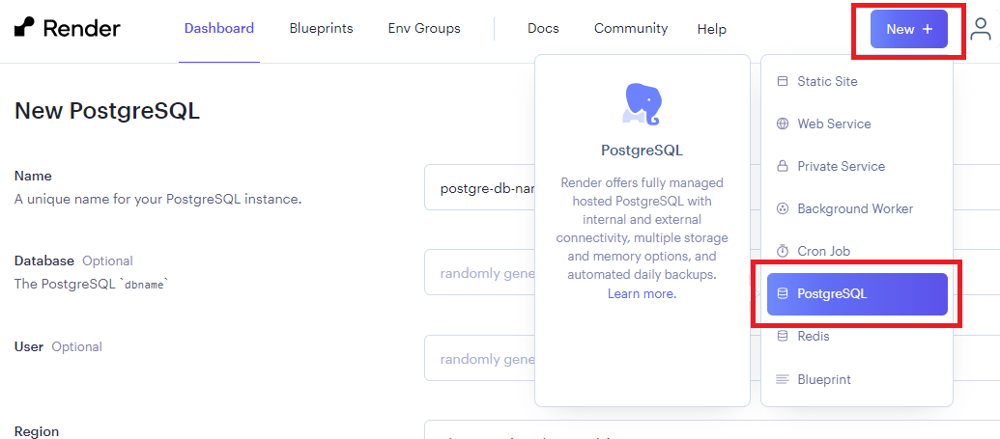
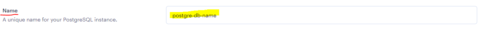
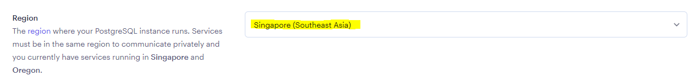
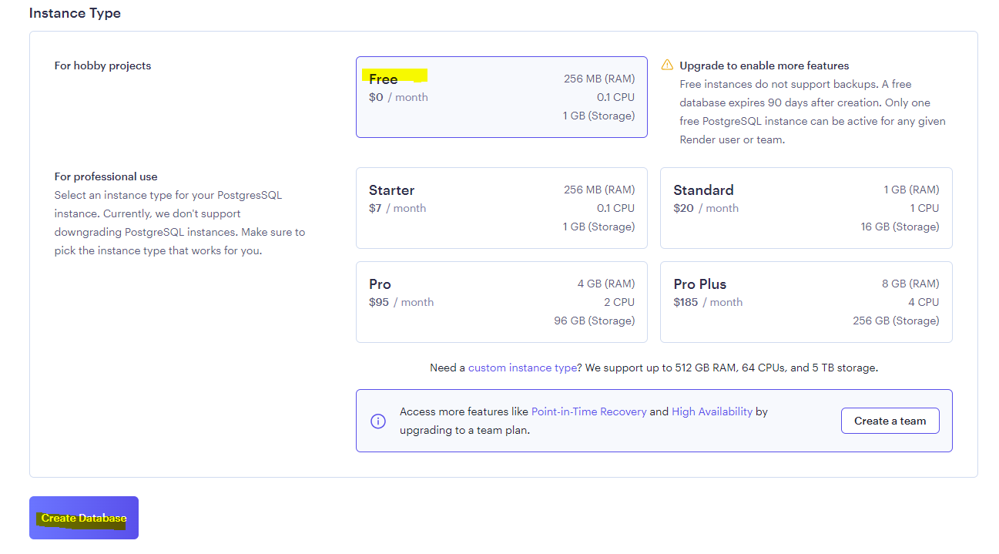
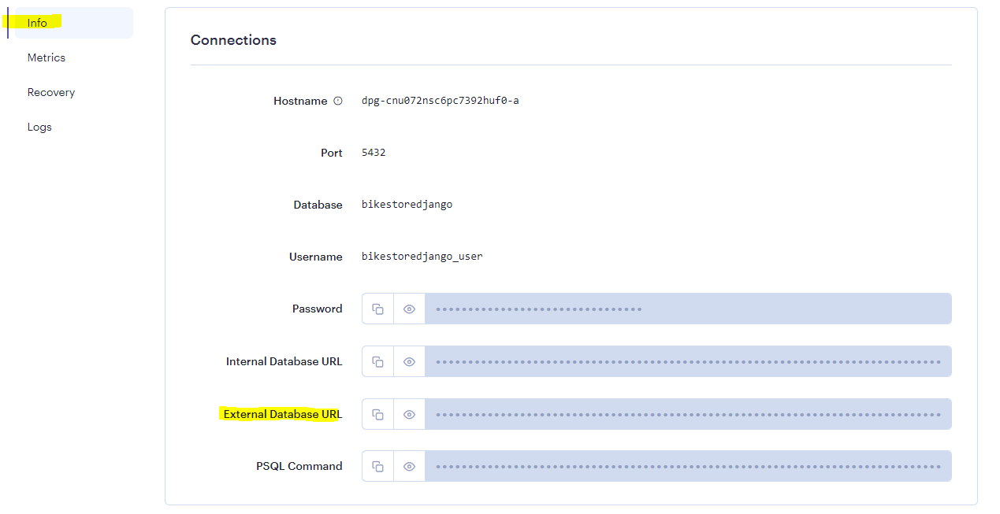
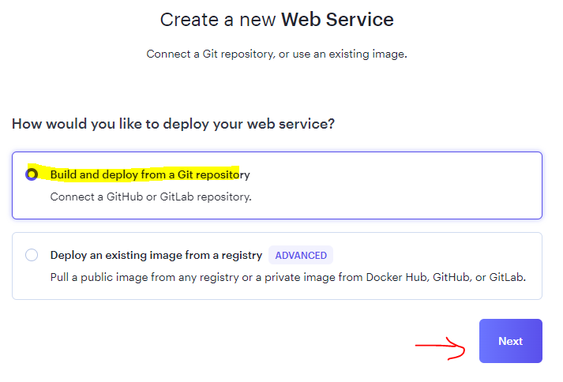
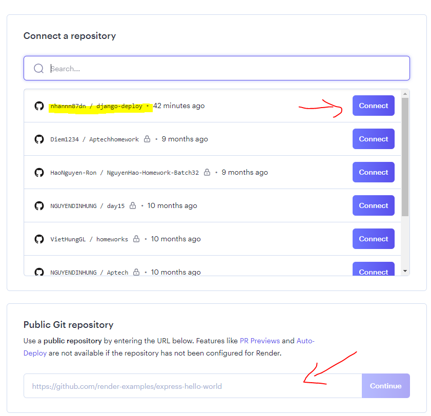
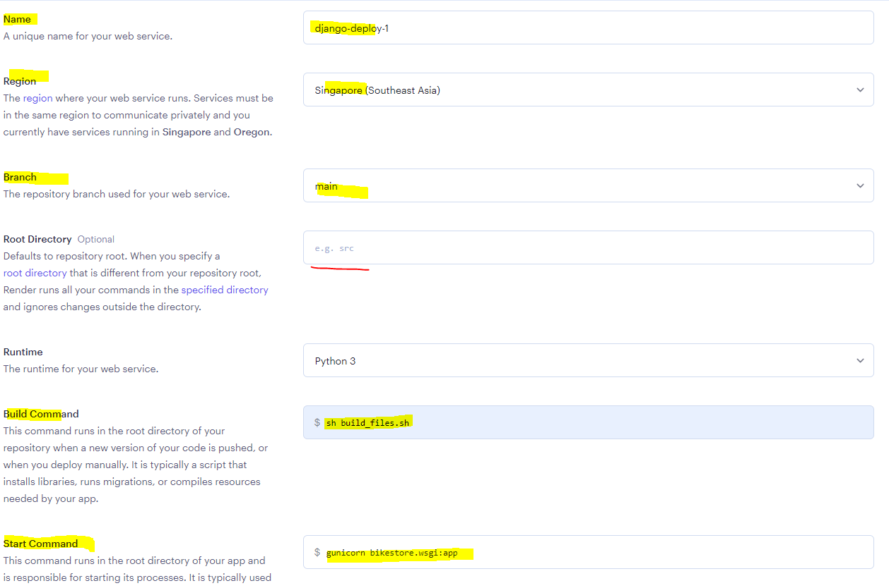
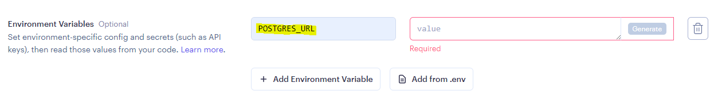

# Session 08 - Deployment

## 💛 Chuẩn bị Deployment

Deploy lên [Render](https://render.com), một dịch vụ cung cấp môi trường Production free cho rất nhiều các ngôn ngữ trong đó có Python.

Bạn cần đăng ký một tài khoản tại https://render.com.

### Bước 1 - Lock in Dependencies

Trong môi trường ảo bạn chạy lệnh

```bash
#Cài thêm 2 gói
pip install gunicorn
pip install dj-database-url
# Tạo file requirements.txt
py -m pip freeze > requirements.txt
```

Nó sẽ sinh ra file chứa tất cả các gói cài đặt của dự án.


### Bước 2 - Tạo Cấu hình lại Setting

Sửa file `settings.py` trong thư mục `bikestore`

```python
# Nhúng thư viện này vào, để kết nối với URL String
import dj_database_url

#Sửa biến này thành
DATABASES = {
    "default": dj_database_url.parse(os.environ.get("POSTGRES_URL"))
}
```

Và 2 biến

```python
DEBUG = False #tắt chế độ debug
ALLOWED_HOSTS = ['*'] #cho phép tất cả các domain
```

Tạo file `build.sh` trong thư mục góc dự án


```sh
echo "BUILD START"
python -m pip install -r requirements.txt
python manage.py collectstatic --noinput --clear
python manage.py migrate
echo "BUILD END"
```


### Bước 3 - Đồng bộ Project lên Github

Bạn cần phải tạo một tài khoản, sau đó tạo một repository để đưa code lên Github.

Mục đích của việc này là để deploy tự động khi chúng ta commit những thay đổi code trong tương lai.


## 💛 Deploy lên Server

### Bước 1 - Tạo database

Đăng nhập vào Dashboard của Render



Vào `New` chọn `PostgreSQL`. Sau đó tại dòng `Name` nhập tên của Database bạn muốn đặt.



Tại dòng Region, chọn Singapore là vị trí đặt server



Chọn gói server là `Free`



Và cuối cùng là `Create Database`

Bạn sẽ tìm thấy được thông tin kết nối Database ở tab Info



### Bước 2 - Tạo database

Trên thanh Navigation tại Button `New` --> Chọn `Web Service` để tạo một webs server với Python



Sau đó chọn như hình trên. Bạn sẽ được hướng dẫn đồng bộ với Github.

Sau khi thành công thì bạn sẽ thấy được một danh sách các repositories như hình dưới.



Tại đây bạn có 2 cách

1. Tại dòng repository --> Connect
1. Hoặc dán URL của repository vào mục bên dưới rồi nhấn nút Continue



Tại bước này bạn lần lượt cấu hình như sau:

- Name: Đặt tên cho web service
- Region: Vị trí đặt server
- Branch: Nhánh chứa code
- Root Directory: Thư mục góc chứa code dự án
- Build Command: nhập vào `sh build.sh`
- Start  Command: nhập vào `gunicorn bikestore.wsgi:application`

Tiếp theo chọn gói Free


Tiếp theo Cấu hình môi trường: 

Tại phần này bạn thêm các biến môi trường cho dự án nếu có.

Mình cần biến `POSTGRES_URL` với giá trị bạn copy ở dòng `External Database URL` ở bước tạo Database trên.




Cuối cùng nhấn `Create Web Service`

Xem log và chờ kết quả Build

Nếu thành công bạn phải thực hiện tạo User quản trị cho Django.

Để làm được điều đó bạn sửa lại

```python
# Nhúng thư viện này vào, để kết nối với URL String
import dj_database_url

#Sửa biến này thành
DATABASES = {
    "default": dj_database_url.parse('POSTGRES_URL')
}
```

Thay `POSTGRES_URL` thành chuỗi `External Database URL` ở bước trên vào.

Sau đó trong môi trường ảo bạn nhập lênh tạo User Admin

```bash
#Window
py manage.py createsuperuser
# MAC, Ubuntu
python manage.py createsuperuser
```

Sau đó đăng nhập vào admin Django để xem kết quả. 

Lưu ý: Dữ liệu lúc này là rỗng. chưa có gì cả.